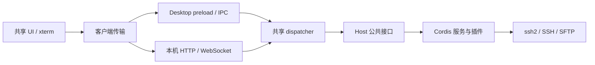

# PureTerm 架构

PureTerm 有 Electron Desktop 和独立本机 Web 两个运行入口，复用四个 npm workspace 包：Host、协议、传输和界面。SSH/SFTP 始终由用户电脑发起，HTTP 服务只监听 `127.0.0.1`。无需用户账号、租户隔离或远程控制隧道。

以下路径相对仓库根。命令见[仓库入口](../README.md)，物理布局见[目录决策](../LAYOUT-PROPOSAL.md)。

## 运行方式

| 入口 | Host 所在进程 | 界面与通信 | 默认数据目录 |
| --- | --- | --- | --- |
| Desktop | Electron 主进程 | Electron 窗口走 IPC；附带本机浏览器入口走 HTTP/WS | `~/.ssh-cordis/` |
| 独立 Web | 普通 Node 进程 | 本机浏览器走 HTTP/WS | `~/.ssh-cordis/web/` |

Desktop 的两个载体共享同一个 Host。独立 Web 另外创建 Host；两个应用共用实现，但不自动共享活动会话或数据文件。Desktop 没有为了这次抽包增加 Host 子进程。

## 请求与事件

`packages/protocol/src/protocol.ts` 定义通道、能力声明、请求、结果、事件和二进制线格式。`packages/transport/src/dispatch.ts` 将协议映射到 Host 公共方法；载体确定客户端身份。Web 对二进制编码传输后恢复为字节，终端不把分包内容提前转成字符串。

事件通过 `RendererBridge` / `RendererHandle` 返回对应客户端。ID 是载体给出的不透明字符串；Host 无需解释 Electron webContents 或 WebSocket 编号。客户端路由与凭据能力分离：`CredentialProvider` 由入口注入 SessionStore，RendererBridge 不承担加解密。

## 模块职责

| 位置 | 职责 |
| --- | --- |
| `packages/host/src/host.ts` | 装配 Cordis Context、导出 Host、管理连接和插件树生命周期 |
| `packages/host/src/services/`、`plugins/` | SSH、TOFU、主机存储、终端/SFTP 桥与日志 |
| `packages/host/src/credentials.ts` | 凭据提供器接口与默认本次会话策略 |
| `packages/protocol/` | 与运行环境无关的协议和公共数据结构 |
| `packages/transport/` | dispatcher、HTTP/WS、载体组合、就绪报文校验 |
| `packages/ui/` | 页面、终端、SFTP、客户端传输及浏览器私钥选择 |
| `apps/desktop/electron/app/` | Electron 启动、窗口、系统加密和原生文件选择 |
| `apps/desktop/electron/runtime/` | 平台策略、就绪闸门、启动档案、重启和资源定位 |
| `apps/desktop/electron/carriers/` | IPC 和 CommonJS preload |
| `apps/desktop/electron/diagnostics/` | 应用进程内的启动与冒烟钩子 |
| `apps/web/src/` | Node 命令行、数据目录、共享 Host 与 HTTP 服务装配 |

services/plugins 保留原有业务分类，并不等于 Service/function plugin 的严格分组。公共 Host 类型从包入口导出，应用无需访问内部实现。

## 依赖与构建

根 `package.json` 声明 workspaces，根 `package-lock.json` 是唯一锁文件，安装使用根 `npm ci`。包之间通过公开导出引用；包内才使用相对源码导入。共享 Host 不依赖 Electron 或 UI，UI 不导入 Node 或 Host，协议没有模块依赖。应用和传输层不读取 `Host.internals`；内部视图只用于测试与诊断。

`scripts/check-boundaries.mjs` 用 TypeScript AST 检查导入、导出、动态 import、require 和内部访问；规则用临时小工程测试。它是依赖约束，不是运行时安全隔离。各包与应用独立做类型检查，浏览器配置使用 DOM 类型，Node/Electron 配置使用其对应环境。

根构建脚本先构建共享包，再构建指定入口，清理对应项目的 `dist/`。共享界面只生成一份 `packages/ui/dist/{index.html,app.js,app.css}`。两个入口通过 `@pureterm/ui/index.html` 的包导出定位页面；Desktop 的 `electron/runtime/paths.ts` 另外根据编译模块位置找到 `dist/electron/carriers/preload.cjs`。独立 Web 入口为 `apps/web/dist/main.js`。这些定位不依赖启动时 cwd。

## 生命周期

Desktop 先应用平台策略、创建当前 shell generation，再装配 Host 和载体。每代窗口、监听器与看门狗由 shell 幂等释放；使用窗口时读取当前代。页面初始化完成并报告 renderer-ready 后，就绪闸门才允许提交启动档案，HTML 已加载不等于应用已可用。

独立 Web 创建默认本次会话策略的 Host，再监听本机端口；监听失败会卸载 Host。Ctrl+C/SIGTERM 关闭载体和全部 SSH 会话。WebSocket 断开会调用 `Host.releaseClient()`，及时关闭该客户端的安静会话，并取消尚未完成的 SSH 握手；其他客户端的会话继续运行。

Host 创建失败会卸载此前装配的服务。关闭 Host 时先取消正在进行的连接、等待它们结束，再卸载插件树；关闭后拒绝新的终端连接。opened 事件无法送到客户端时也会收尾，避免浏览器关闭与握手完成竞态留下连接。

Desktop 保留现有沙箱、GPU、启动档案与重启行为。`SSH_CORDIS_NO_SANDBOX_FALLBACK=1` 禁止自动无沙箱回退及对应档案回填；`SSH_CORDIS_NO_LAUNCH_PROFILE=1` 禁止读写档案。档案未按 CI、容器或日常环境分区，测试使用临时目录。

## 数据与入口能力

Desktop 通过 `SSH_CORDIS_DATA_DIR` 覆盖数据目录。`hosts.json` 保存主机元数据及私钥路径；`secrets.json` 保存 safeStorage 生成的密文；`known_hosts.json` 保存 TOFU 指纹；`launch-profile.json` 保存已就绪启动的配置。私钥文件在连接时读取，不复制到主机存储。附带的本机浏览器入口使用相同加密能力和原生选钥。

独立 Web 可通过 `--data-dir` 或 `SSH_CORDIS_WEB_DATA_DIR` 设置目录，命令行优先。它保存 `hosts.json` 和 `known-hosts.json`，不读写 `secrets.json`、不持久化私钥路径，公开记录的 `hasSecret` 恒为 false。即使调用方请求记住密码或口令，也不会保存。若目录已存在凭据文件或旧版内嵌密文，Host 会明确拒绝，原文件不迁移、不覆盖。

浏览器通过文件选择器读取私钥内容，不把文件名当成本机绝对路径。密码、私钥及口令保留在当前页面，刷新后重填。UI 根据入口返回的能力选择浏览器/原生选钥，并关闭独立 Web 的凭据记忆选项。默认两个进程使用不同数据文件；自定义目录时也不应让它们同时写入同一份 JSON 存储。

HTTP 资源和 WebSocket 要求启动 token 或对应会话 cookie，并校验本机 Host 与来源；绑定地址不能扩为公开网卡。token 每次启动重新生成，页面初始化后从地址栏移除。Desktop 可通过 `SSH_CORDIS_NO_WEB_CARRIER=1` 关闭自己的附带 Web 入口，不影响独立 Web 启动器。

SFTP 复用已建立的 SSH 会话，支持目录浏览、单文件上传/下载、新建目录和删除。共享协议的 `MAX_TRANSFER_BYTES` 限定单文件为 4 MiB；当前一次读取完整内容，没有流式传输、续传、进度报告或重命名功能。

## 验证与上游关系

根 `verify` 构建全部项目，执行类型、边界、Host 生命周期/凭据策略、UI 逻辑、独立 Web 及 SSH/SFTP/HTTP/WS 协议测试。根 `verify:electron` 覆盖 Desktop boot、IPC、Desktop Web 和独立 Node Web 的真实浏览器流程；其中 Electron 只充当最后一项的测试浏览器，Web 服务仍由普通 Node 启动。

Electron 检查使用隔离的用户目录、受控窗口和严格的成功/失败/退出/超时判定，并回收测试进程。验证禁用自动无沙箱回退，因此不覆盖两代真实 Electron 的自动回退。GUI 鼠标键盘验收不在上述命令内，本机 ssh2 夹具也不代表所有真实 sshd 的兼容性覆盖。

本项目参考 deepseek-harness 的 Cordis 依赖与作用域、共享 Host/Client 和入口适配边界；基线见[历史评审](reviews/layout-review-2026-09-16.md)。上游 Desktop 使用独立 Node Host 子进程，Web Client 本身也是 Cordis 应用。PureTerm 当前保留进程内 Desktop Host 和普通 UI 模块；安装包、自动更新、Desktop Host 进程拆分及前端插件树尚未实现。
