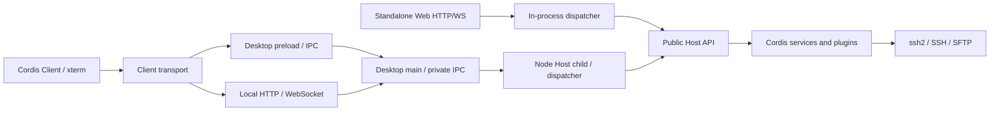

# PureTerm Architecture

[中文版本](architecture_zh.md)

PureTerm has two runtime entry points, Electron Desktop and standalone local Web, backed by four npm workspace packages: Host, protocol, transport, and UI. SSH/SFTP connections are always initiated by the user’s computer, and HTTP services bind only to `127.0.0.1`. There are no user accounts, tenant isolation, or remote-control tunnels.

The paths below are relative to the repository root. See the [repository guide](../README.md) for commands and the [layout decision](../LAYOUT-PROPOSAL.md) for the physical layout.

## Runtime modes

| Entry point | Host process | UI and communication | Default data directory |
| --- | --- | --- | --- |
| Desktop | independent Node Host child process | Electron window over IPC; attached local browser over HTTP/WS; main process forwards through private IPC | `~/.ssh-cordis/` |
| standalone Web | ordinary Node process | local browser over HTTP/WS | `~/.ssh-cordis/web/` |

Desktop’s two carriers share one Host in the child process. Standalone Web creates a separate Host; the applications share implementation but do not automatically share active sessions or data files. Electron launches the Host child in Node mode, and that entry does not load the Electron API.

## Requests and events

`packages/protocol/src/protocol.ts` defines channels, capabilities, requests, results, events, and the binary wire format. `packages/transport/src/dispatch.ts` maps the protocol to public Host methods; a carrier supplies client identity. Web restores binary payloads to bytes after transport encoding, and the terminal never converts chunks to strings prematurely.

Events return through `RendererBridge` / `RendererHandle` to the corresponding client. IDs are opaque strings supplied by a carrier; Host does not interpret Electron `webContents` or WebSocket identifiers. Client routing is separate from credential capabilities: an entry point injects `CredentialProvider` into `SessionStore`, while `RendererBridge` does not encrypt or decrypt data.

## Module responsibilities

| Location | Responsibility |
| --- | --- |
| `packages/host/src/host.ts` | assemble Cordis Context, export Host, and manage connection/plugin-tree lifecycle |
| `packages/host/src/services/`, `plugins/` | SSH, TOFU, host storage, terminal/SFTP bridge, and logging |
| `packages/host/src/credentials.ts` | credential-provider interface and default session-only policy |
| `packages/protocol/` | environment-neutral protocol and shared data structures |
| `packages/transport/` | dispatcher, HTTP/WS, carrier composition, and readiness validation |
| `packages/ui/` | Cordis Client, page, terminal, SFTP, client transport, and browser key selection |
| `apps/desktop/electron/app/` | Electron startup, windows, system encryption, native file picker, and update adapter |
| `apps/desktop/electron/host/` | Node Host child entry with no Electron import |
| `apps/desktop/electron/runtime/` | platform policy, readiness, profiles, child/RPC control, update coordination, and resource paths |
| `apps/desktop/electron/carriers/` | IPC and CommonJS preload |
| `apps/desktop/electron/diagnostics/` | in-process startup and smoke hooks |
| `apps/web/src/` | Node CLI, data directory, shared Host, and HTTP service assembly |

The `services/` and `plugins/` names preserve the existing business grouping; they are not a strict Service/function-plugin classification. Public Host types are exported from the package entry, so applications do not access internal implementations.

## Dependencies and build

The root `package.json` declares workspaces and the root `package-lock.json` is the only lockfile. Packages reference one another through public exports; relative source imports are limited to modules inside a package. Shared Host has no Electron or UI dependency, UI imports neither Node nor Host, and protocol has no module dependency. Applications and transport never read `Host.internals`; the internal view exists only for tests and diagnostics.

`scripts/check-boundaries.mjs` uses the TypeScript AST to check imports, exports, dynamic imports, `require`, and internal access; the rules are exercised in a temporary fixture project. This is a dependency constraint, not runtime security isolation. Each package and application has its own type check; browser builds use DOM types and Node/Electron builds use their corresponding environments.

Root build scripts build shared packages first, then the selected entry, and clean the corresponding `dist/`. The shared UI produces one `packages/ui/dist/{index.html,app.js,app.css}`. Both entries locate the page through the `@pureterm/ui/index.html` package export; Desktop’s `electron/runtime/paths.ts` separately locates `dist/electron/carriers/preload.cjs` by compiled module location. The standalone Web entry is `apps/web/dist/main.js`. None of these paths depend on the launch cwd.

## Lifecycle

Desktop applies platform policy, starts the Node Host, completes a versioned handshake, and installs carriers before creating a shell generation. This prevents page requests before readiness. Each window generation, listener, and watchdog has an idempotent release path; window operations read the current generation. The readiness gate accepts a launch profile only after the renderer reports `renderer-ready`; loaded HTML alone does not mean the application is usable.

Private parent/child IPC uses advanced serialization to preserve `Uint8Array` and carries requests/results, events, client release, encryption, and key-picker capabilities. Disconnects reject pending requests; an unexpected Host exit reports an error and ends the application. Shutdown, startup failure, diagnostics, and updates wait for the child to close and terminate it after the deadline. When the parent dies, the child cancels business work after `disconnect` and exits. Closing a window or a loaded renderer crash releases that client.

Standalone Web creates a Host with the default session-only policy and then listens on the loopback port; a listen failure unloads Host. Ctrl+C/SIGTERM closes carriers and all SSH sessions. A WebSocket disconnect calls `Host.releaseClient()`, promptly closing idle sessions owned by that client and cancelling an unfinished SSH handshake; other clients continue running.

If Host creation fails, already assembled services are unloaded. Host shutdown first cancels connection and encryption waits, waits for accepted storage mutations, and then unloads the plugin tree; after shutdown, new connections and mutations are rejected. Save/remove operations are serialized, and new state is not committed before encryption completes. If an `opened` event cannot reach its client, cleanup still runs so a browser-close/handshake race cannot leave a connection behind.

The shared Client is a Cordis Context created by `createClient()`. It installs view, transport, terminal, Keychain, hosts, SFTP, and application/readiness services in order, with dependencies declared through `inject`. Each scope releases DOM listeners, transport subscriptions, `ResizeObserver`, timers, private-key drafts, and terminal resources. The root can be unmounted and mounted again; unloading a dependency scope unloads its dependents. IPC dispose cancels that client’s sessions while keeping the bridge reusable, and Web dispose closes the socket.

Desktop retains sandbox, GPU, launch-profile, and restart behavior. `SSH_CORDIS_NO_SANDBOX_FALLBACK=1` disables automatic no-sandbox fallback and profile backfill; `SSH_CORDIS_NO_LAUNCH_PROFILE=1` disables profile reads and writes. Profiles are not separated for CI, containers, and daily use; tests use temporary directories.

### Terminal tab ownership

`ClientTerminal` owns a collection of tab records, each with an xterm instance, immutable connection-request snapshot, status, logs, and an optional Host session ID. Hosts is a separate permanent page. Selection changes visibility and sizing only; background output is routed by session ID. A disconnect retains its tab and scrollback, whereas closing a tab disposes that terminal and closes only its SSH session.

Concurrent handshakes are associated with tabs using their own `open()` RPC replies, not the currently selected tab or `opened` event order. Events preceding the reply are buffered by session ID with a 1 MiB per-session limit. Closing a pending tab removes its view immediately and closes a subsequently returned session; the existing protocol does not provide per-open-request cancellation. Client disposal still releases all sessions and pending handshakes through the transport. WebSocket loss reports closure for every tracked session.

`ClientSftp` shares one rendered panel but retains directory, visibility, busy state, and navigation revision per session. Async results only update their owning state, so a background request cannot overwrite the selected tab's files. Closing/disconnecting a session invalidates its file state. Retry credentials remain in client memory for the tab lifetime and are not serialized as session restoration data. No Host or wire-protocol change is required.

## Data and entry capabilities

Desktop overrides its data directory with `SSH_CORDIS_DATA_DIR`. `hosts.json` stores host metadata and either a private-key path or a Keychain key ID; `secrets.json` stores host credential ciphertext; `known_hosts.json` stores TOFU fingerprints; `launch-profile.json` stores the ready launch configuration. safeStorage remains in the main process, and Host’s asynchronous `CredentialProvider` calls it over private IPC. Without a usable system encryption backend, the app does not fall back to plaintext persistence. Directly selected private-key files are read at connection time and are not copied into host storage. The attached local browser uses the same encryption and native picker capabilities.

Keychain imports use a separate `keychain.json` vault: each entry contains an opaque ID and system-encrypted JSON holding its metadata, private key, and optional passphrase. Writes use a same-directory temporary file (0600) and atomic rename; an encryption or write failure leaves the prior vault intact. Startup decrypts only to build public metadata, and authentication decrypts the selected entry inside Host; list/save replies never include private material. Host serializes key and host mutations together, rejects invalid references, prevents deletion of referenced keys, and drains accepted writes before shutdown. `keys:list/save/remove` traverse the shared dispatcher and both carriers. SSH certificates and hardware-backed keys are outside this implementation.

The client-only `SshApi.onDisconnected()` subscription propagates WebSocket generation loss even without an SSH session. Keychain clears unsaved drafts on transport loss; session-only clients additionally clear key cards and cached host-key references without requiring a page reload. UI operation ownership prevents an old save/delete refresh from unlocking a newer request. Switching a shared Web host away from private-key authentication invalidates its associations in every client, and explicitly supplied private-key content takes precedence over an implicit session association.

Standalone Web accepts `--data-dir` or `SSH_CORDIS_WEB_DATA_DIR`, with the command-line option taking precedence. It stores `hosts.json` and `known-hosts.json`, never reads or writes credential or Keychain vault contents, never persists a private-key path or Keychain association, and reports `hasSecret: false` in public records. Requests to remember a password or passphrase are ignored. Imported keys and host-key associations stay in per-client Host maps, are inaccessible to other clients, and are removed by `releaseClient()`. Queued mutations from a released client are cancelled. If the directory contains a credential vault or legacy embedded ciphertext, Host rejects it explicitly and does not migrate or overwrite the original.

The browser File API reads private-key content and never treats the filename as a local absolute path. Passwords, private keys, and passphrases stay in the current page and must be entered again after a refresh. UI capabilities select browser or native key picking and disable credential memory for standalone Web. The two processes use separate default files; custom directories must also avoid concurrent writes to the same JSON store.

HTTP resources and WebSockets require the startup token or its session cookie and validate the local Host header and Origin. The bind address cannot expand to a public interface. A new token is generated for each launch and removed from the address bar after page initialization. `SSH_CORDIS_NO_WEB_CARRIER=1` disables Desktop’s attached local Web entry without affecting the standalone Web launcher.

SFTP reuses an established SSH session and supports directory browsing, single-file upload/download, directory creation, and deletion. The shared protocol’s `MAX_TRANSFER_BYTES` limits one file to 4 MiB; the current implementation reads the complete file and has no streaming, resume, progress reporting, or rename operation.

## Verification and upstream relationship

Root `verify` builds every project and runs type, boundary, Host child-process/credential, update-coordinator, packaging-isolation, UI, standalone Web, and SSH/SFTP/HTTP/WS protocol tests. Root `verify:electron` covers Desktop boot, IPC, attached Desktop Web, renderer-crash cleanup, real updater download and checksum validation, standalone Node Web, and Client-scope lifecycle. Electron acts only as the test browser in the standalone Web flow; the service still starts in ordinary Node.

Electron checks use an isolated user directory, controlled windows, strict success/failure/exit/timeout signals, and process-tree cleanup. Automatic no-sandbox fallback is disabled, so both generations of real Electron fallback are outside this check. GUI mouse/keyboard acceptance is outside these commands, and the local ssh2 fixture does not cover every real sshd implementation.

PureTerm follows deepseek-harness’s Cordis dependency/scope model, shared Host/Client boundary, and entry-point adapters. PureTerm now has an independent Node Desktop Host, shared Cordis Client, installer build, and update coordination. The implementation uses a static plugin tree and Node IPC and does not add upstream Agents or dynamic plugin management.

Installers are built from independent staging with physical production dependencies and shared resources, and asar is disabled to keep child-process files real. Windows uses NSIS, macOS uses dmg+zip, and Linux uses AppImage. Packaged builds check and download updates from GitHub Releases and stop Host before a user-confirmed restart. Development builds do not check; local and ordinary CI runs do not publish; a tag job creates a draft. Versions and user-visible changes are kept in the root [CHANGELOG.md](../CHANGELOG.md), and `scripts/changelog.mjs` checks workspace versions and extracts draft notes. Signing, notarization, platform builds, and acceptance limits are in the [release guide](desktop-release.md).
