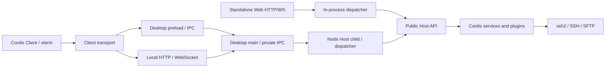
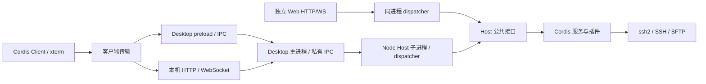

# PureTerm Architecture

PureTerm has two runtime entry points, Electron Desktop and standalone local Web, backed by four npm workspace packages: Host, protocol, transport, and UI. SSH/SFTP connections are always initiated by the user’s computer, and HTTP services bind only to `127.0.0.1`. There are no user accounts, tenant isolation, or remote-control tunnels.

The paths below are relative to the repository root. See the [repository guide](../README.md) for commands and the [layout decision](../LAYOUT-PROPOSAL.md) for the physical layout.

## Runtime modes

| Entry point | Host process | UI and communication | Default data directory |
| --- | --- | --- | --- |
| Desktop | independent Node Host child process | Electron window over IPC; attached local browser over HTTP/WS; main process forwards through private IPC | `~/.ssh-cordis/` |
| standalone Web | ordinary Node process | local browser over HTTP/WS | `~/.ssh-cordis/web/` |

Desktop’s two carriers share one Host in the child process. Standalone Web creates a separate Host; the applications share implementation but do not automatically share active sessions or data files. Electron launches the Host child in Node mode, and that entry does not load the Electron API.

## Requests and events

`packages/protocol/src/protocol.ts` defines channels, capabilities, requests, results, events, and the binary wire format. `packages/transport/src/dispatch.ts` maps the protocol to public Host methods; a carrier supplies client identity. Web restores binary payloads to bytes after transport encoding, and the terminal never converts chunks to strings prematurely.

Events return through `RendererBridge` / `RendererHandle` to the corresponding client. IDs are opaque strings supplied by a carrier; Host does not interpret Electron `webContents` or WebSocket identifiers. Client routing is separate from credential capabilities: an entry point injects `CredentialProvider` into `SessionStore`, while `RendererBridge` does not encrypt or decrypt data.

## Module responsibilities

| Location | Responsibility |
| --- | --- |
| `packages/host/src/host.ts` | assemble Cordis Context, export Host, and manage connection/plugin-tree lifecycle |
| `packages/host/src/services/`, `plugins/` | SSH, TOFU, host storage, terminal/SFTP bridge, and logging |
| `packages/host/src/credentials.ts` | credential-provider interface and default session-only policy |
| `packages/protocol/` | environment-neutral protocol and shared data structures |
| `packages/transport/` | dispatcher, HTTP/WS, carrier composition, and readiness validation |
| `packages/ui/` | Cordis Client, page, terminal, SFTP, client transport, and browser key selection |
| `apps/desktop/electron/app/` | Electron startup, windows, system encryption, native file picker, and update adapter |
| `apps/desktop/electron/host/` | Node Host child entry with no Electron import |
| `apps/desktop/electron/runtime/` | platform policy, readiness, profiles, child/RPC control, update coordination, and resource paths |
| `apps/desktop/electron/carriers/` | IPC and CommonJS preload |
| `apps/desktop/electron/diagnostics/` | in-process startup and smoke hooks |
| `apps/web/src/` | Node CLI, data directory, shared Host, and HTTP service assembly |

The `services/` and `plugins/` names preserve the existing business grouping; they are not a strict Service/function-plugin classification. Public Host types are exported from the package entry, so applications do not access internal implementations.

## Dependencies and build

The root `package.json` declares workspaces and the root `package-lock.json` is the only lockfile. Packages reference one another through public exports; relative source imports are limited to modules inside a package. Shared Host has no Electron or UI dependency, UI imports neither Node nor Host, and protocol has no module dependency. Applications and transport never read `Host.internals`; the internal view exists only for tests and diagnostics.

`scripts/check-boundaries.mjs` uses the TypeScript AST to check imports, exports, dynamic imports, `require`, and internal access; the rules are exercised in a temporary fixture project. This is a dependency constraint, not runtime security isolation. Each package and application has its own type check; browser builds use DOM types and Node/Electron builds use their corresponding environments.

Root build scripts build shared packages first, then the selected entry, and clean the corresponding `dist/`. The shared UI produces one `packages/ui/dist/{index.html,app.js,app.css}`. Both entries locate the page through the `@pureterm/ui/index.html` package export; Desktop’s `electron/runtime/paths.ts` separately locates `dist/electron/carriers/preload.cjs` by compiled module location. The standalone Web entry is `apps/web/dist/main.js`. None of these paths depend on the launch cwd.

## Lifecycle

Desktop applies platform policy, starts the Node Host, completes a versioned handshake, and installs carriers before creating a shell generation. This prevents page requests before readiness. Each window generation, listener, and watchdog has an idempotent release path; window operations read the current generation. The readiness gate accepts a launch profile only after the renderer reports `renderer-ready`; loaded HTML alone does not mean the application is usable.

Private parent/child IPC uses advanced serialization to preserve `Uint8Array` and carries requests/results, events, client release, encryption, and key-picker capabilities. Disconnects reject pending requests; an unexpected Host exit reports an error and ends the application. Shutdown, startup failure, diagnostics, and updates wait for the child to close and terminate it after the deadline. When the parent dies, the child cancels business work after `disconnect` and exits. Closing a window or a loaded renderer crash releases that client.

Standalone Web creates a Host with the default session-only policy and then listens on the loopback port; a listen failure unloads Host. Ctrl+C/SIGTERM closes carriers and all SSH sessions. A WebSocket disconnect calls `Host.releaseClient()`, promptly closing idle sessions owned by that client and cancelling an unfinished SSH handshake; other clients continue running.

If Host creation fails, already assembled services are unloaded. Host shutdown first cancels connection and encryption waits, waits for accepted storage mutations, and then unloads the plugin tree; after shutdown, new connections and mutations are rejected. Save/remove operations are serialized, and new state is not committed before encryption completes. If an `opened` event cannot reach its client, cleanup still runs so a browser-close/handshake race cannot leave a connection behind.

The shared Client is a Cordis Context created by `createClient()`. It installs view, transport, terminal, hosts, SFTP, and application/readiness services in order, with dependencies declared through `inject`. Each scope releases DOM listeners, transport subscriptions, `ResizeObserver`, timers, and terminal resources. The root can be unmounted and mounted again; unloading a dependency scope unloads its dependents. IPC dispose cancels that client’s sessions while keeping the bridge reusable, and Web dispose closes the socket.

Desktop retains sandbox, GPU, launch-profile, and restart behavior. `SSH_CORDIS_NO_SANDBOX_FALLBACK=1` disables automatic no-sandbox fallback and profile backfill; `SSH_CORDIS_NO_LAUNCH_PROFILE=1` disables profile reads and writes. Profiles are not separated for CI, containers, and daily use; tests use temporary directories.

## Data and entry capabilities

Desktop overrides its data directory with `SSH_CORDIS_DATA_DIR`. `hosts.json` stores host metadata and private-key paths; `secrets.json` stores safeStorage ciphertext; `known_hosts.json` stores TOFU fingerprints; `launch-profile.json` stores the ready launch configuration. safeStorage remains in the main process, and Host’s asynchronous `CredentialProvider` calls it over private IPC. Without a usable system encryption backend, the app does not fall back to plaintext persistence. Private-key files are read at connection time and are never copied into host storage. The attached local browser uses the same encryption and native picker capabilities.

Standalone Web accepts `--data-dir` or `SSH_CORDIS_WEB_DATA_DIR`, with the command-line option taking precedence. It stores `hosts.json` and `known-hosts.json`, never reads or writes `secrets.json`, never persists a private-key path, and reports `hasSecret: false` in public records. Requests to remember a password or passphrase are ignored. If the directory contains a credential file or legacy embedded ciphertext, Host rejects it explicitly and does not migrate or overwrite the original.

The browser File API reads private-key content and never treats the filename as a local absolute path. Passwords, private keys, and passphrases stay in the current page and must be entered again after a refresh. UI capabilities select browser or native key picking and disable credential memory for standalone Web. The two processes use separate default files; custom directories must also avoid concurrent writes to the same JSON store.

HTTP resources and WebSockets require the startup token or its session cookie and validate the local Host header and Origin. The bind address cannot expand to a public interface. A new token is generated for each launch and removed from the address bar after page initialization. `SSH_CORDIS_NO_WEB_CARRIER=1` disables Desktop’s attached local Web entry without affecting the standalone Web launcher.

SFTP reuses an established SSH session and supports directory browsing, single-file upload/download, directory creation, and deletion. The shared protocol’s `MAX_TRANSFER_BYTES` limits one file to 4 MiB; the current implementation reads the complete file and has no streaming, resume, progress reporting, or rename operation.

## Verification and upstream relationship

Root `verify` builds every project and runs type, boundary, Host child-process/credential, update-coordinator, packaging-isolation, UI, standalone Web, and SSH/SFTP/HTTP/WS protocol tests. Root `verify:electron` covers Desktop boot, IPC, attached Desktop Web, renderer-crash cleanup, real updater download and checksum validation, standalone Node Web, and Client-scope lifecycle. Electron acts only as the test browser in the standalone Web flow; the service still starts in ordinary Node.

Electron checks use an isolated user directory, controlled windows, strict success/failure/exit/timeout signals, and process-tree cleanup. Automatic no-sandbox fallback is disabled, so both generations of real Electron fallback are outside this check. GUI mouse/keyboard acceptance is outside these commands, and the local ssh2 fixture does not cover every real sshd implementation.

PureTerm follows deepseek-harness’s Cordis dependency/scope model, shared Host/Client boundary, and entry-point adapters. PureTerm now has an independent Node Desktop Host, shared Cordis Client, installer build, and update coordination. The implementation uses a static plugin tree and Node IPC and does not add upstream Agents or dynamic plugin management.

Installers are built from independent staging with physical production dependencies and shared resources, and asar is disabled to keep child-process files real. Windows uses NSIS, macOS uses dmg+zip, and Linux uses AppImage. Packaged builds check and download updates from GitHub Releases and stop Host before a user-confirmed restart. Development builds do not check; local and ordinary CI runs do not publish; a tag job creates a draft. Versions and user-visible changes are kept in the root [CHANGELOG.md](../CHANGELOG.md), and `scripts/changelog.mjs` checks workspace versions and extracts draft notes. Signing, notarization, platform builds, and acceptance limits are in the [release guide](desktop-release.md).

中文版本

# PureTerm 架构

PureTerm 有 Electron Desktop 和独立本机 Web 两个运行入口，复用四个 npm workspace 包：Host、协议、传输和界面。SSH/SFTP 始终由用户电脑发起，HTTP 服务只监听 `127.0.0.1`。无需用户账号、租户隔离或远程控制隧道。

以下路径相对仓库根。命令见[仓库入口](../README.md)，物理布局见[目录决策](../LAYOUT-PROPOSAL.md)。

## 运行方式

| 入口 | Host 所在进程 | 界面与通信 | 默认数据目录 |
| --- | --- | --- | --- |
| Desktop | 独立 Node Host 子进程 | Electron 窗口走 IPC；附带本机浏览器入口走 HTTP/WS；主进程通过私有 IPC 转发 | `~/.ssh-cordis/` |
| 独立 Web | 普通 Node 进程 | 本机浏览器走 HTTP/WS | `~/.ssh-cordis/web/` |

Desktop 的两个载体共享子进程中的同一个 Host。独立 Web 另外创建 Host；两个应用共用实现，但不自动共享活动会话或数据文件。Host 子进程通过 Electron 可执行文件的 Node 模式启动，不加载 Electron API。

## 请求与事件

`packages/protocol/src/protocol.ts` 定义通道、能力声明、请求、结果、事件和二进制线格式。`packages/transport/src/dispatch.ts` 将协议映射到 Host 公共方法；载体确定客户端身份。Web 对二进制编码传输后恢复为字节，终端不把分包内容提前转成字符串。

事件通过 `RendererBridge` / `RendererHandle` 返回对应客户端。ID 是载体给出的不透明字符串；Host 无需解释 Electron webContents 或 WebSocket 编号。客户端路由与凭据能力分离：`CredentialProvider` 由入口注入 SessionStore，RendererBridge 不承担加解密。

## 模块职责

| 位置 | 职责 |
| --- | --- |
| `packages/host/src/host.ts` | 装配 Cordis Context、导出 Host、管理连接和插件树生命周期 |
| `packages/host/src/services/`、`plugins/` | SSH、TOFU、主机存储、终端/SFTP 桥与日志 |
| `packages/host/src/credentials.ts` | 凭据提供器接口与默认本次会话策略 |
| `packages/protocol/` | 与运行环境无关的协议和公共数据结构 |
| `packages/transport/` | dispatcher、HTTP/WS、载体组合、就绪报文校验 |
| `packages/ui/` | Cordis Client、页面、终端、SFTP、客户端传输及浏览器私钥选择 |
| `apps/desktop/electron/app/` | Electron 启动、窗口、系统加密、原生文件选择和更新适配 |
| `apps/desktop/electron/host/` | 不导入 Electron 的 Node Host 子进程入口 |
| `apps/desktop/electron/runtime/` | 平台策略、就绪、档案、子进程/RPC、更新协调与资源定位 |
| `apps/desktop/electron/carriers/` | IPC 和 CommonJS preload |
| `apps/desktop/electron/diagnostics/` | 应用进程内的启动与冒烟钩子 |
| `apps/web/src/` | Node 命令行、数据目录、共享 Host 与 HTTP 服务装配 |

services/plugins 保留原有业务分类，并不等于 Service/function plugin 的严格分组。公共 Host 类型从包入口导出，应用无需访问内部实现。

## 依赖与构建

根 `package.json` 声明 workspaces，根 `package-lock.json` 是唯一锁文件，安装使用根 `npm ci`。包之间通过公开导出引用；包内才使用相对源码导入。共享 Host 不依赖 Electron 或 UI，UI 不导入 Node 或 Host，协议没有模块依赖。应用和传输层不读取 `Host.internals`；内部视图只用于测试与诊断。

`scripts/check-boundaries.mjs` 用 TypeScript AST 检查导入、导出、动态 import、require 和内部访问；规则用临时小工程测试。它是依赖约束，不是运行时安全隔离。各包与应用独立做类型检查，浏览器配置使用 DOM 类型，Node/Electron 配置使用其对应环境。

根构建脚本先构建共享包，再构建指定入口，清理对应项目的 `dist/`。共享界面只生成一份 `packages/ui/dist/{index.html,app.js,app.css}`。两个入口通过 `@pureterm/ui/index.html` 的包导出定位页面；Desktop 的 `electron/runtime/paths.ts` 另外根据编译模块位置找到 `dist/electron/carriers/preload.cjs`。独立 Web 入口为 `apps/web/dist/main.js`。这些定位不依赖启动时 cwd。

## 生命周期

Desktop 先应用平台策略，启动 Node Host、完成带版本的握手并装配载体，然后创建 shell generation，避免页面请求早于服务就绪。每代窗口、监听器与看门狗由 shell 幂等释放；使用窗口时读取当前代。页面初始化完成并报告 renderer-ready 后，就绪闸门才允许提交启动档案，HTML 已加载不等于应用已可用。

私有父子 IPC 使用 advanced serialization 保留 Uint8Array，提供请求/结果、事件、客户端释放及加解密/选钥能力。断线拒绝挂起请求；Host 意外退出会报告错误并结束应用。退出、启动失败、诊断结束与更新均等待子进程关闭；超过关停期限则终止进程。父进程死亡时，子进程收到 disconnect 后取消业务并退出。窗口关闭或已加载的渲染进程崩溃会释放对应客户端。

独立 Web 创建默认本次会话策略的 Host，再监听本机端口；监听失败会卸载 Host。Ctrl+C/SIGTERM 关闭载体和全部 SSH 会话。WebSocket 断开会调用 `Host.releaseClient()`，及时关闭该客户端的安静会话，并取消尚未完成的 SSH 握手；其他客户端的会话继续运行。

Host 创建失败会卸载此前装配的服务。关闭 Host 时先取消连接和解密等待、等候已接受的存储修改，再卸载插件树；关闭后拒绝新连接与修改。save/remove 串行执行，加密完成前不会提交新状态。opened 事件无法送到客户端时也会收尾，避免浏览器关闭与握手完成竞态留下连接。

共享 Client 由 `createClient()` 创建 Cordis Context，依次装配 view、transport、terminal、hosts、SFTP 和 application/readiness 服务，依赖通过 `inject` 声明。各 scope 通过 effect 释放 DOM 监听、传输订阅、ResizeObserver、定时器和终端。根卸载后可重新挂载；依赖 scope 释放会同时卸载依赖者。IPC dispose 取消该客户端会话且保留 bridge 可重新订阅，Web dispose 关闭 socket。

Desktop 保留现有沙箱、GPU、启动档案与重启行为。`SSH_CORDIS_NO_SANDBOX_FALLBACK=1` 禁止自动无沙箱回退及对应档案回填；`SSH_CORDIS_NO_LAUNCH_PROFILE=1` 禁止读写档案。档案未按 CI、容器或日常环境分区，测试使用临时目录。

## 数据与入口能力

Desktop 通过 `SSH_CORDIS_DATA_DIR` 覆盖数据目录。`hosts.json` 保存主机元数据及私钥路径；`secrets.json` 保存 safeStorage 生成的密文；`known_hosts.json` 保存 TOFU 指纹；`launch-profile.json` 保存已就绪启动的配置。safeStorage 留在主进程，Host 的异步 CredentialProvider 经私有 IPC 请求加解密；没有可用系统加密后端时不退化为明文持久化。私钥文件在连接时读取，不复制到主机存储。附带的本机浏览器入口使用相同加密能力和原生选钥。

独立 Web 可通过 `--data-dir` 或 `SSH_CORDIS_WEB_DATA_DIR` 设置目录，命令行优先。它保存 `hosts.json` 和 `known-hosts.json`，不读写 `secrets.json`、不持久化私钥路径，公开记录的 `hasSecret` 恒为 false。即使调用方请求记住密码或口令，也不会保存。若目录已存在凭据文件或旧版内嵌密文，Host 会明确拒绝，原文件不迁移、不覆盖。

浏览器通过文件选择器读取私钥内容，不把文件名当成本机绝对路径。密码、私钥及口令保留在当前页面，刷新后重填。UI 根据入口返回的能力选择浏览器/原生选钥，并关闭独立 Web 的凭据记忆选项。默认两个进程使用不同数据文件；自定义目录时也不应让它们同时写入同一份 JSON 存储。

HTTP 资源和 WebSocket 要求启动 token 或对应会话 cookie，并校验本机 Host 与来源；绑定地址不能扩为公开网卡。token 每次启动重新生成，页面初始化后从地址栏移除。Desktop 可通过 `SSH_CORDIS_NO_WEB_CARRIER=1` 关闭自己的附带 Web 入口，不影响独立 Web 启动器。

SFTP 复用已建立的 SSH 会话，支持目录浏览、单文件上传/下载、新建目录和删除。共享协议的 `MAX_TRANSFER_BYTES` 限定单文件为 4 MiB；当前一次读取完整内容，没有流式传输、续传、进度报告或重命名功能。

## 验证与上游关系

根 `verify` 构建全部项目，执行类型、边界、Host 子进程/凭据、更新协调、打包隔离、UI 逻辑、独立 Web 及 SSH/SFTP/HTTP/WS 协议测试。根 `verify:electron` 覆盖 Desktop boot、IPC、Desktop Web、渲染崩溃回收、真实更新器的本机下载及校验、独立 Node Web 和 Client 作用域生命周期。独立 Web 流程中 Electron 只充当测试浏览器，Web 服务仍由普通 Node 启动。

Electron 检查使用隔离的用户目录、受控窗口和严格的成功/失败/退出/超时判定，并回收测试进程。验证禁用自动无沙箱回退，因此不覆盖两代真实 Electron 的自动回退。GUI 鼠标键盘验收不在上述命令内，本机 ssh2 夹具也不代表所有真实 sshd 的兼容性覆盖。

本项目参考 deepseek-harness 的 Cordis 依赖与作用域、共享 Host/Client 和入口适配边界。PureTerm 已实现独立 Node Desktop Host、共享 Cordis Client、安装构建和自动更新协调。这里采用静态插件树与 Node IPC，没有引入上游 Agent 和动态插件管理。

安装包从独立 staging 构建，复制物理生产依赖与共享资源，关闭 asar，避免子进程依赖工作区文件。Windows 使用 NSIS，macOS 使用 dmg+zip，Linux 使用 AppImage。打包版从 GitHub Releases 检查并下载更新，用户确认后先停止 Host，再重启安装。开发版不检查；本地/普通 CI 不发布；版本 tag 的发布 job 汇总为 draft。版本和用户可见变化记录在根目录 [CHANGELOG.md](../CHANGELOG.md)，`scripts/changelog.mjs` 校验所有 workspace 版本并提取 draft notes。签名、notarization、平台构建和验收边界见[发布说明](desktop-release.md)。

