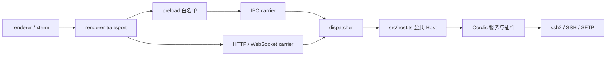

# Desktop 架构

PureTerm 是一个 npm 包内的 Electron 应用。Electron 主进程创建并持有 Cordis Host，业务通过 `Host` 公共接口提供；renderer 运行在 Chromium 渲染进程，通过 IPC 或 HTTP/WebSocket 访问相同协议。默认同时启用桌面 IPC 和监听回环地址的 Web carrier。

以下路径均相对 `apps/desktop/`。目录决策见[已采纳方案](../LAYOUT-PROPOSAL.md)，启动与测试命令见[应用说明](../apps/desktop/README.md)。

## 请求与事件路径



`shared/protocol.ts` 定义通道名、请求结果、事件和线格式。`electron/bridge/dispatch.ts` 负责协议名到 Host 调用的映射；carrier 负责传输、客户端身份和生命周期。Web 传输将二进制编码后过线，在接收端恢复为字节。

输出事件经 `RendererBridge` / `RendererHandle` 返回相应客户端。客户端 ID 是不透明字符串，Host 不解释 Electron 的 webContents ID。所需公共类型由 `src/host.ts` 导出，壳无需引用业务内部模块。

## 模块职责

| 位置 | 职责 |
| --- | --- |
| `src/host.ts` | 创建 Cordis Context、装配依赖、导出 Host，并卸载整棵插件树 |
| `src/services/`、`src/plugins/` | SSH、TOFU、主机与凭据存储、终端/SFTP 桥和日志观察 |
| `shared/` | 两侧共享的协议与数据结构 |
| `renderer/` | 页面交互、xterm、布局、SFTP 面板和客户端传输适配 |
| `electron/app/` | 应用启动、窗口代际和平台 API 的实际调用 |
| `electron/runtime/` | 平台决策、就绪闸门、启动档案、重启及构建资源定位；不导入 Electron |
| `electron/bridge/` | 请求分派；只调用 Host 公共接口，不导入 Electron |
| `electron/carriers/` | IPC、HTTP/WS、preload 与多个载体的合成桥 |
| `electron/diagnostics/` | 在应用进程中运行的启动及冒烟钩子，随应用构建 |
| `scripts/`、`tests/` | 应用构建/启动工具、依赖约束、测试和夹具 |

`services/`、`plugins/` 是保留的本项目分类，并不等于“前者都是 Service，后者都是 function plugin”。例如 plugins 中的多个类同样继承 Cordis Service；`src/host.ts` 本身承担装配职责。

## 依赖约束

业务、页面和协议有独立依赖范围：`src/` 不依赖 Electron 壳或 renderer；`renderer/` 不导入 Node、Electron 或 Host 实现；`shared/` 不依赖任一运行侧。Electron 模块只能通过 `src/host.ts` 使用业务公共接口；生产壳不读取 `Host.internals`，内部视图用于测试和诊断。

`electron/app/`、IPC、preload 和必要诊断钩子允许使用 Electron API。`electron/runtime/` 与 dispatcher 保持不导入 Electron，可用 Node 测试启动决策与协议映射。不能禁止 app 层使用它负责适配的 API，也不能用导入文件数代替依赖检查。

`scripts/check-boundaries.mjs` 用 TypeScript AST 检查导入、导出、动态 import、require 及受限内部访问，并接入 `typecheck`。规则测试以临时小工程验证接受与拒绝。该检查是源码约束，不是运行时安全隔离。

Node/Electron 与浏览器分别做类型检查。`tsconfig.json` 包含主进程侧源码并提供基础配置；`tsconfig.main.json` 在其基础上发射主进程产物；`tsconfig.renderer.json` 独立检查 DOM 环境。当前没有 npm workspace、TypeScript project references 或 solution-only 聚合配置，也没有上游 Host/Client 同名 Cordis Context 合并带来的编译面冲突。

## 窗口、Host 与启动生命周期

1. 平台决策在窗口创建前计算；`electron/app/platform.ts` 将菜单、应用及 Chromium 配置施加到 Electron。
2. `main.ts` 先创建当前 shell generation，再创建 Host，最后安装依赖 Host 的 dispatcher 与载体。传给 Host 的合成桥按需读取载体列表。每一代 shell 拥有自己的窗口、监听器与看门狗，通过幂等 `release()` 释放；使用窗口时读取当前代，避免缓存已销毁对象。
3. 页面完成初始化后发送 renderer-ready。HTML 加载或进程存在不足以证明应用可用；成功报告打开就绪闸门后才提交启动档案和执行依赖就绪的动作。
4. 重启模块管理自己创建的子进程，并处理启动失败；退出时由各拥有者关闭窗口、载体与 Host，Cordis 作用域回收连接和监听器。

Host 在 Electron 主进程内运行，没有单独的 Host 可执行文件或进程协议。多个载体共享 Host 和用户档案；Web 入口默认监听 `127.0.0.1`，每次启动生成新 token，并检查访问来源。可用 `SSH_CORDIS_NO_WEB_CARRIER=1` 关闭本次 Web 入口。

沙箱、GPU 和启动档案策略保留现有行为。启动失败时应用可能按既有策略尝试无沙箱回退；`SSH_CORDIS_NO_SANDBOX_FALLBACK=1` 禁止自动回退及相应档案回填，`SSH_CORDIS_NO_LAUNCH_PROFILE=1` 禁止读取和写入档案。档案没有独立的运行环境分区，因此测试使用临时 `SSH_CORDIS_DATA_DIR`，避免影响日常配置。

## 构建与资源定位

`build` 清理本应用 `dist/` 后构建三个部分：TypeScript 主进程、esbuild 生成的 CommonJS preload、renderer HTML/JS/CSS。产物为：

```text
dist/
  electron/app/main.js
  electron/carriers/preload.cjs
  electron/runtime/...
  electron/bridge/...
  electron/diagnostics/...
  src/...
  shared/...
  renderer/index.html
  renderer/app.js
  renderer/app.css
```

`electron/runtime/paths.ts` 根据编译模块的位置定位 renderer 目录和 preload 文件；窗口加载与 Web 静态服务使用同一份 renderer 产物。package main/start、各启动器及 preload 的输入输出必须与该布局一致。preload 由独立打包步骤生成 CJS，主进程 tsc 不为它另发射 ESM 文件。

资源测试覆盖非应用 cwd、页面/脚本/样式存在及 CJS preload。启动检查进一步观察真实 renderer-ready，IPC/Web 冒烟通过本机 SSH 夹具验证载体请求和字节流。三类 Electron 验证共用 `scripts/electron-runner.mjs`，在隔离用户目录中运行，检查失败标记、退出状态和超时，并回收测试进程树。验证时禁用自动无沙箱回退，因此这些用例不覆盖两代真实 Electron 的回退流程。

## 数据与能力范围

默认数据目录为用户主目录的 `.ssh-cordis/`，由 `SSH_CORDIS_DATA_DIR` 覆盖。`hosts.json` 保存主机元数据与私钥路径，`secrets.json` 保存通过壳提供的系统加密能力生成的密文，`known_hosts.json` 保存 TOFU 指纹，`launch-profile.json` 保存已就绪启动的配置。私钥内容按连接时的路径读取，不复制到主机元数据。

SFTP 复用已建立的 SSH 会话，支持目录浏览、单文件上传/下载、新建目录与删除；单文件上限由共享协议的 `MAX_TRANSFER_BYTES` 限定为 4 MiB。当前传输一次加载完整内容，尚未实现流式传输、续传或进度报告。Web 客户端共享同一个后端与凭据域，不是多用户服务。

## 与上游的关系

本项目借鉴 Cordis 服务依赖、作用域卸载、平台决策、窗口代际和载体边界。对照版本与证据见[历史评审](reviews/layout-review-2026-09-16.md)。

该版本 deepseek-harness Desktop 使用独立 Node 子进程承载 Host，拥有进程、升级等产品职责；它的 Web Client 本身是 Cordis 应用，Desktop 复用 client graph。PureTerm 当前采用进程内 Host、默认本机 Web carrier 和普通 renderer 模块。前端插件树、Host 进程拆分、安装更新及多包发布都属于后续独立设计决策。
