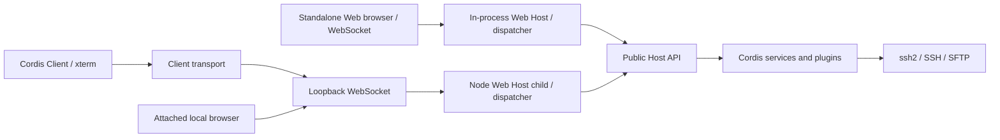

# PureTerm Architecture

[中文版本](architecture_zh.md)

PureTerm has two runtime entry points, Electron Desktop and standalone local Web, backed by five npm workspace packages: Host, protocol, i18n, transport, and UI. SSH/SFTP connections are always initiated by the user’s computer, and HTTP services bind only to `127.0.0.1`. There are no user accounts, tenant isolation, or remote-control tunnels.

The paths below are relative to the repository root. See the [repository guide](../README.md) for commands and the [layout decision](../LAYOUT-PROPOSAL.md) for the physical layout.

## Runtime modes

| Entry point | Host process | UI and communication | Default data directory |
| --- | --- | --- | --- |
| Desktop | independent Node-mode Web Host child process | `pureterm-app://app/` window and optional local browser use the child-owned loopback WebSocket | `~/.ssh-cordis/` |
| standalone Web | ordinary Node process | local browser over HTTP/WS | `~/.ssh-cordis/web/` |

Desktop’s window and optional attached browser share one Web Host in the child process. Standalone Web creates a separate Web Host with the same `startWebHost()` assembly; the applications do not automatically share active sessions or data files. Electron launches the child in Node mode, and that entry does not load the Electron API.

## Requests and events

```mermaid
flowchart LR
  U[Cordis Client / xterm] --> T[Client transport]
  T --> W[Loopback WebSocket]
  W --> D[Node Web Host child / dispatcher]
  B[Attached local browser] --> W
  W2[Standalone Web browser / WebSocket] --> D2[In-process Web Host / dispatcher]
  D2 --> H[Public Host API]
  D --> H
  H --> C[Cordis services and plugins]
  C --> S[ssh2 / SSH / SFTP]
```

`packages/protocol/src/protocol.ts` defines channels, capabilities, requests, results, events, and the binary wire format. A failure crosses as `{code, params, message}` — an identity plus its parameters rather than a pre-rendered sentence — so the interface can say it in the reader's language; `@pureterm/i18n` holds those sentences and is the only place user-facing copy lives. `packages/transport/src/web-host.ts` assembles Host, dispatcher, and HTTP/WS carrier once for both entries. The dispatcher maps the protocol to public Host methods; each WebSocket supplies client identity. The transport restores binary payloads to bytes without converting terminal chunks to strings.

Events return through `RendererBridge` / `RendererHandle` to the corresponding client. IDs are opaque WebSocket client IDs; Host does not interpret Electron `webContents`. Client routing is separate from credential capabilities: an entry point injects `CredentialProvider` into `SessionStore`, while `RendererBridge` does not encrypt or decrypt data.

Resource monitoring is a request pair plus an event stream on that same dispatcher, not a carrier of its own. `monitor:start` and `monitor:stop` are accepted only from the client that owns the session, and `monitor:update` is delivered back to that client alone. The probe itself is an ordinary bounded exec on the session's existing SSH connection. `session:facts` is the exception that has no request side and no subscription: it reports the negotiated cipher and server host key once per handshake, and its routing is independent of monitoring, so unloading the monitor plugin leaves it working. No monitoring message travels over private Electron IPC.

## Module responsibilities

| Location | Responsibility |
| --- | --- |
| `packages/host/src/host.ts` | assemble Cordis Context, export Host, and manage connection/plugin-tree lifecycle |
| `packages/host/src/services/`, `plugins/` | SSH, TOFU, host storage, terminal/SFTP bridge, bounded exec, Linux resource monitoring, and logging |
| `packages/host/src/credentials.ts` | credential-provider interface and default session-only policy |
| `packages/i18n/` | message catalog and `t()`; the only place user-facing copy lives. Host reports failures as codes from `@pureterm/protocol` and never imports this |
| `packages/protocol/` | environment-neutral protocol and shared data structures |
| `packages/transport/` | shared Web Host assembly, dispatcher, HTTP/WS, and readiness validation |
| `packages/ui/` | Cordis Client, page, terminal, the terminal-local tool rail and its shared panel, SFTP, client transport, and browser key selection |
| `apps/desktop/electron/app/` | Electron startup, windows, system encryption, native file picker, and update adapter |
| `apps/desktop/electron/host/` | Node Host child entry with no Electron import |
| `apps/desktop/electron/runtime/` | platform policy, readiness, profiles, child/RPC control, update coordination, and resource paths |
| `apps/desktop/electron/carriers/` | minimal CommonJS preload bootstrap plus the readiness and locale reports |
| `apps/desktop/electron/diagnostics/` | in-process startup and smoke hooks |
| `apps/web/src/` | Node CLI, data directory, and standalone policy injected into shared Web Host |

The `services/` and `plugins/` names preserve the existing business grouping; they are not a strict Service/function-plugin classification. Public Host types are exported from the package entry, so applications do not access internal implementations.

## Dependencies and build

The root `package.json` declares workspaces and the root `package-lock.json` is the only lockfile. Packages reference one another through public exports; relative source imports are limited to modules inside a package. Shared Host has no Electron or UI dependency, UI imports neither Node nor Host, and protocol has no module dependency. Applications and transport never read `Host.internals`; the internal view exists only for tests and diagnostics.

`scripts/check-boundaries.mjs` uses the TypeScript AST to check imports, exports, dynamic imports, `require`, and internal access; the rules are exercised in a temporary fixture project. This is a dependency constraint, not runtime security isolation. Each package and application has its own type check; browser builds use DOM types and Node/Electron builds use their corresponding environments.

Root build scripts build shared packages first, then the selected entry, and clean the corresponding `dist/`. The shared UI produces `packages/ui/dist/{index.html,app.js,app.css}` plus a second, desktop-only sheet, `packages/ui/dist/desktop.css`, which carries the window controls and is linked at runtime by `services/chrome.ts` and never by the standalone Web entry. Both entries locate the shared page through the `@pureterm/ui/index.html` package export. Desktop serves those files through the secure `pureterm-app://app/` scheme and locates `dist/electron/carriers/preload.cjs` by compiled module location. The standalone Web entry is `apps/web/dist/main.js`. None of these paths depend on the launch cwd.

For the UI's own layout, [design tokens and stylesheet layout](design-system.md) is the authority: every colour value in the stylesheet lives in one file, `packages/ui/src/styles/tokens.css`, which holds both theme groups, and `packages/ui/src/style.css` is only an `@import` manifest over the role-based partials that resolve colour through those tokens.

## Lifecycle

Before it reads a launch profile, opens a credential, or starts a Host, Desktop claims a single-instance lock and binds its SSH data directory to one profile. The binding is a durable record, `<dataDir>/desktop-profile.json`, written once with exclusive create and never auto-rewritten or auto-rebound: a launch whose `userData` does not match it stops with an explicit message rather than letting two processes write the same store, and a second instance either focuses the owner or reports the directory it asked for. Moving existing data to another profile is a deliberate data/encryption migration, not a silent rebind.

Desktop applies platform policy, registers the custom scheme and scoped WebSocket authorization, starts the Node Web Host, and creates a shell generation while Host startup continues. The page loads immediately; its minimal preload waits for Host readiness before receiving the loopback WebSocket URL. Each window generation, listener, and watchdog has an idempotent release path; window operations read the current generation. The readiness gate accepts a launch profile only after the current main frame reports `renderer-ready`; loaded HTML alone does not mean the application is usable. The page reports a second, independent fact — which language it is showing — because the preference lives in the renderer and the shell's own menu and native dialogs sit outside the document; the main process narrows the value before believing it and rebuilds the menu, and until the first report that menu is English, the catalog's source language.

Private parent/child IPC carries startup, shutdown, encryption, and native key-picker capabilities. The main process holds a separate Desktop bearer token and injects it only into the current application window’s exact Host WebSocket request, rewriting Origin to the loopback Host. The token never reaches page URLs, DOM, preload bootstrap, logs, or storage. Application exit, startup failure, diagnostics, and updates wait for the child to close and terminate it after the deadline. Closing or crashing a renderer closes its WebSocket and releases its sessions; other browser clients continue while the Host remains running. Closing the last window exits the app on Windows/Linux, while macOS keeps the Host available for window reactivation.

An unexpected Host exit, a failed startup handshake, or a shutdown timeout writes one bounded, allowlisted report under `<userData>/diagnostics/host/` and then offers an explicit choice of restarting the application or quitting. The report carries only version, time, platform, architecture, phase, reason, and process facts — never host names, paths, credentials, tokens, commands, or terminal output — is written 0600 through a temporary file and rename, and retains only the newest five. A restart relaunches the process with the same data directory and startup switches and does not restore SSH sessions or terminal tabs, so it begins from a clean profile rather than a half-torn-down one; the client’s own recovery — a dropped socket ends every live tab — is what releases the old sessions. The hand-off itself is ordered rather than a race: the replacement inherits the predecessor’s streams, is told the predecessor’s process id, and waits for that process to exit before it claims single-instance ownership, so it cannot lose the profile to the process it is replacing; the predecessor exits only after confirming the replacement is alive and, if it never appears, stays put with a non-zero exit code instead of leaving nothing behind.

An ordinary quit — closing the last window on Windows/Linux, the menu item, or Cmd+Q — is one decision point. It inspects the Host’s accepted-work counts, asks the user only when there is activity or the counts could not be read, takes a shutdown lease that closes admission, drains finite accepted work within a bounded budget, inspects again inside the lease, and only then stops the Host; cancelling, a conflicting request, or a failure to prepare leaves the window, WebSocket, and sessions untouched and restores admission. An update takes the same path with a stricter rule: it is prepared only after the Host acknowledges a clean, signal-free exit, so a forced termination never counts as a successful install, and a cancelled or busy preparation keeps the downloaded update and the running Host.

Standalone Web injects the default session-only policy into the shared Web Host and then listens on the loopback port; a listen failure unloads Host. Ctrl+C/SIGTERM closes the carrier and all SSH sessions. A WebSocket disconnect calls `Host.releaseClient()`, promptly closing idle sessions owned by that client and cancelling an unfinished SSH handshake; other clients continue running.

If Host creation fails, already assembled services are unloaded. Host shutdown first cancels connection and encryption waits, waits for accepted storage mutations, and then unloads the plugin tree; after shutdown, new connections and mutations are rejected. Save/remove operations are serialized, and new state is not committed before encryption completes. If an `opened` event cannot reach its client, cleanup still runs so a browser-close/handshake race cannot leave a connection behind.

The shared Client is a Cordis Context created by `createClient()`. It installs view, transport, shortcuts, terminal, session-tools, Keychain, hosts, SFTP, monitoring, chrome, and application/readiness services in order, with dependencies declared through `inject`. Each scope releases DOM listeners, transport subscriptions, `ResizeObserver`, timers, private-key drafts, and terminal resources. The root can be unmounted and mounted again; unloading a dependency scope unloads its dependents. Client disposal closes its WebSocket and releases its Host sessions.

Resource monitoring keeps one subscription per session on the Host, scheduled on probe completion rather than on a fixed tick, and the client keeps one record per terminal tab. The client collects only while a tab is selected, connected, visible, with its tool panel open on the monitor and not manually paused; every other state retires the subscription, and a replaced subscription is stopped before a new one starts. Host `releaseClient`, dependency unload, and shutdown each clear the registrations and timers they own, and a missing monitor service answers with a controlled unsupported result instead of preventing terminal or Host disposal.

Desktop retains sandbox, GPU, launch-profile, and restart behavior. `SSH_CORDIS_NO_SANDBOX_FALLBACK=1` disables automatic no-sandbox fallback and profile backfill; `SSH_CORDIS_NO_LAUNCH_PROFILE=1` disables profile reads and writes. Profiles are not separated for CI, containers, and daily use; tests use temporary directories.

### Shortcut ownership

`ClientShortcuts` is the one registry for workspace commands, and the neutral binding table in `@pureterm/protocol` is the one definition of them, so the native and DOM paths cannot disagree or both fire. Desktop binds a per-generation `before-input-event` adapter that stays inert until the renderer reports a context and consumes a key only when that same table resolves it to a command; the standalone and attached Web clients listen for `keydown` in the capture phase instead. Both resolve against strict modifier equality — one extra Shift does not match — pass Alt/AltGr through to the input method and the remote, ignore key-up, and let nothing through while an IME composition or a modal owns the keyboard. Opening the host editor leaves only Escape to the workspace. A command is re-checked for enablement at execution time, because the native path may be holding a slightly stale context, and the help list is rendered from the same bindings the matcher uses. Bindings are Ctrl+Tab / Ctrl+Shift+Tab for tab cycling on every platform, primary+W to close a tab, primary+Backquote to focus the terminal, primary+E for Files, primary+K for host search, and Escape to dismiss the host editor, where primary is Cmd on macOS and Ctrl elsewhere.

### Terminal tab ownership

`ClientTerminal` owns a collection of tab records, each with an xterm instance, immutable connection-request snapshot, status, logs, and an optional Host session ID. Hosts is a separate permanent page. Selection changes visibility and sizing only; background output is routed by session ID. A dropped connection retains its tab and scrollback, whereas closing a tab disposes that terminal and closes only its SSH session.

Concurrent handshakes are associated with tabs using their own `open()` RPC replies, not the currently selected tab or `opened` event order. Events preceding the reply are buffered by session ID with a 1 MiB per-session limit. Closing a pending tab removes its view immediately and closes a subsequently returned session; the existing protocol does not provide per-open-request cancellation. Client disposal still releases all sessions and pending handshakes through the transport. WebSocket loss reports closure for every tracked session.

`ClientSessionTools` owns the terminal page's right-hand rail: the tool buttons each feature registers, the one shared panel slot and splitter, and which tool the selected tab has open. Selection is remembered by terminal tab ID, so switching tabs swaps both the panel and the split ratio and no tab inherits another's. Effective visibility requires a connected tab, a registered tool, and a remembered selection; a management page, a disconnected or failed tab, or an unregistered tool leaves the rail in place with the panel closed and its buttons disabled. The rail is a column of `#session-workspace`, so it leaves with the terminal page rather than staying on the shell's right edge, and it is excluded from the split ratio, which describes only the terminal and panel tracks. Disposal removes the buttons, the panel and the splitter; a feature that unregisters clears its selection in every remembered tab. No Host or wire-protocol change is required.

`ClientSftp` renders into that shared slot and retains directory, busy state, and navigation revision per session. Async results only update their owning state, so a background request cannot overwrite the selected tab's files or take the slot from the active tool. Closing/disconnecting a session invalidates its file state. Retry credentials remain in client memory for the tab lifetime and are not serialized as session restoration data.

## Data and entry capabilities

Desktop overrides its data directory with `SSH_CORDIS_DATA_DIR`. `hosts.json` stores host metadata and either a private-key path or a Keychain key ID; `secrets.json` stores host credential ciphertext; `known_hosts.json` stores TOFU fingerprints; `launch-profile.json` stores the ready launch configuration; `desktop-profile.json` is the ownership record binding the directory to one `userData`; and `diagnostics/host/` holds the bounded Host-failure reports. safeStorage remains in the main process, and Host’s asynchronous `CredentialProvider` calls it over private IPC. Without a usable system encryption backend, the app does not fall back to plaintext persistence. Directly selected private-key files are read at connection time and are not copied into host storage. The attached local browser uses the same encryption and native picker capabilities.

Keychain imports use a separate `keychain.json` vault: each entry contains an opaque ID and system-encrypted JSON holding its metadata, private key, and optional passphrase. Writes use a same-directory temporary file (0600) and atomic rename; an encryption or write failure leaves the prior vault intact. Startup decrypts only to build public metadata, and authentication decrypts the selected entry inside Host; list/save replies never include private material. Host serializes key and host mutations together, rejects invalid references, prevents deletion of referenced keys, and drains accepted writes before shutdown. `keys:list/save/remove` traverse the shared dispatcher and WebSocket carrier. SSH certificates and hardware-backed keys are outside this implementation.

The client-only `SshApi.onDisconnected()` subscription propagates WebSocket generation loss even without an SSH session. Keychain clears unsaved drafts on transport loss; session-only clients additionally clear key cards and cached host-key references without requiring a page reload. UI operation ownership prevents an old save/delete refresh from unlocking a newer request. Switching a shared Web host away from private-key authentication invalidates its associations in every client, and explicitly supplied private-key content takes precedence over an implicit session association.

Standalone Web accepts `--data-dir` or `SSH_CORDIS_WEB_DATA_DIR`, with the command-line option taking precedence. It stores `hosts.json` and `known-hosts.json`, never reads or writes credential or Keychain vault contents, never persists a private-key path or Keychain association, and reports `hasSecret: false` in public records. Requests to remember a password or passphrase are ignored. Imported keys and host-key associations stay in per-client Host maps, are inaccessible to other clients, and are removed by `releaseClient()`. Queued mutations from a released client are cancelled. If the directory contains a credential vault or legacy embedded ciphertext, Host rejects it explicitly and does not migrate or overwrite the original.

The browser File API reads private-key content and never treats the filename as a local absolute path. Passwords, private keys, and passphrases stay in the current page and must be entered again after a refresh. UI capabilities select browser or native key picking and disable credential memory for standalone Web. The two processes use separate default files; custom directories must also avoid concurrent writes to the same JSON store.

Browser HTTP resources and WebSockets require the startup token or its session cookie and validate the local Host header and Origin. Desktop’s internal WebSocket instead accepts the main-process bearer credential. The bind address cannot expand to a public interface. A new browser token is generated for each launch and removed from the address bar after page initialization. `SSH_CORDIS_NO_WEB_CARRIER=1` disables only Desktop’s attached ordinary-browser entry; its internal Web Host and the standalone Web launcher still work.

SFTP reuses an established SSH session and supports directory browsing, single-file upload/download, directory creation, and deletion. The shared protocol’s `MAX_TRANSFER_BYTES` limits one file to 4 MiB; the current implementation reads the complete file and has no streaming, resume, progress reporting, or rename operation.

Resource monitoring runs one fixed command per probe, every five seconds, over a non-interactive exec channel on the session's existing SSH connection. It parses `/proc` output and reports six metrics: CPU busy percentage, memory used, load averages, root-filesystem disk usage, summed non-loopback network throughput, and host uptime. It assumes a Linux remote with a POSIX shell, readable `/proc`, and a `df` that reports the root mount; it does not run as root and does not read anything privileged, so a mount the account cannot see is not reported. CPU and network are deltas, so the first probe after any new subscription is reported as warming up rather than as zero, and the baselines are reset whenever a subscription is replaced. Disk is the root filesystem alone, not every mount. An unavailable counter keeps its reason, a non-Linux remote is reported as unsupported, and the app never invents a value for a metric the remote did not supply. The retained probe output is bounded, and a probe that exceeds its bound is a rejection rather than a partial reading. The status bar’s cipher and host-key cells are separate: they come from the handshake, are constant for the connection, and are not part of the polling row.

## Verification and upstream relationship

Root `verify` builds every project and runs type, boundary, Host child-process/credential, profile-ownership, Host lifecycle/admission, shutdown-coordinator, update-coordinator, crash-report, fatal-recovery, shortcut, packaging-isolation, UI, standalone Web, and SSH/SFTP/HTTP/WS protocol tests, including the bounded-exec and Linux-collector suites and the Web monitoring routing tests. Root `verify:electron` covers Desktop custom-scheme boot, WebSocket SSH/Keychain traffic, a fixture resource snapshot and session facts rendered through the real Desktop and standalone Web UIs, attached Desktop Web, renderer-crash cleanup, real updater download and checksum validation, standalone Node Web, Client-scope lifecycle, single-profile ownership between two real launches, cancellable quit protection, and Host-failure recovery, including the ordered hand-off that reuses the same profile without racing the previous process for it. Both entry flows also assert the terminal tool rail — its workspace ancestry, the two registered buttons, the workspace drawing one band above its content, Files/Monitor switching, and its absence on management pages. A separate styled-layout check serves the built stylesheet, fonts and a real xterm, and measures the rail at six viewports in both themes and both languages: 52px width, button size, ancestry, panel switching on the active axis, independent panel scrolling, and positive terminal dimensions for the same session across open and close. Electron acts only as the test browser in the standalone Web flow; the service still starts in ordinary Node.

Electron checks use an isolated user directory, controlled windows, strict success/failure/exit/timeout signals, and process-tree cleanup. Automatic no-sandbox fallback is disabled, so both generations of real Electron fallback are outside this check. GUI mouse/keyboard acceptance is outside these commands, and the local ssh2 fixture does not cover every real sshd implementation.

The September 23 Desktop migration used deepseek-harness commit `00102833dfaee1da9f48a3a8eae9d34005a75218` as its adaptation baseline. On September 30, the local reference checkout was updated to `639ed015397290b3745d163aafe02ffee4aa3f84` (`dsh-v0.2.0-rc.2`); the [dated architecture comparison](reports/2026-09-30-desktop-architecture-comparison.md) records alignment, implementation differences, and missing capabilities without implying that every upstream feature has been adopted. PureTerm follows the thin Desktop wrapper and Cordis dependency/scope model while keeping an independent Node-mode Web Host, shared Cordis Client, installer build, and update coordination. Private Node IPC is reserved for platform capabilities and lifecycle; PureTerm business traffic uses WebSocket, while upstream uses HTTP RPC and WebSocket streams. PureTerm does not add upstream Agents or dynamic plugin management.

Installers are built from independent staging with physical production dependencies and shared resources, and asar is disabled to keep child-process files real. Windows uses NSIS, macOS uses dmg+zip, and Linux uses AppImage. Packaged builds check and download updates from GitHub Releases and stop Host before a user-confirmed restart. Development builds do not check; local and ordinary CI runs do not publish; a tag job creates a draft. Versions and user-visible changes are kept in the root [CHANGELOG.md](../CHANGELOG.md), and `scripts/changelog.mjs` checks workspace versions and extracts draft notes. Signing, notarization, platform builds, and acceptance limits are in the [release guide](desktop-release.md).
