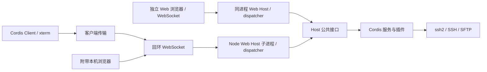

# PureTerm 架构

[English version](architecture.md)

PureTerm 有 Electron Desktop 和独立本机 Web 两个运行入口，复用四个 npm workspace 包：Host、协议、传输和界面。SSH/SFTP 始终由用户电脑发起，HTTP 服务只监听 `127.0.0.1`。无需用户账号、租户隔离或远程控制隧道。

以下路径相对仓库根。命令见[仓库入口](../README_zh.md)，物理布局见[目录决策](../LAYOUT-PROPOSAL_zh.md)。

## 运行方式

| 入口 | Host 所在进程 | 界面与通信 | 默认数据目录 |
| --- | --- | --- | --- |
| Desktop | 独立 Node 模式 Web Host 子进程 | `pureterm-app://app/` 窗口与可选本机浏览器共用子进程的回环 WebSocket | `~/.ssh-cordis/` |
| 独立 Web | 普通 Node 进程 | 本机浏览器走 HTTP/WS | `~/.ssh-cordis/web/` |

Desktop 窗口与可选的附带浏览器共享子进程中的一个 Web Host。独立 Web 使用相同的 `startWebHost()` 装配另建 Web Host；两个应用不自动共享活动会话或数据文件。子进程通过 Electron 可执行文件的 Node 模式启动，不加载 Electron API。

## 请求与事件

`packages/protocol/src/protocol.ts` 定义通道、能力声明、请求、结果、事件和二进制线格式。`packages/transport/src/web-host.ts` 为两个入口统一装配 Host、dispatcher 和 HTTP/WS 载体。dispatcher 将协议映射到 Host 公共方法；每条 WebSocket 确定客户端身份。传输层将二进制载荷恢复为字节，不把终端分包提前转成字符串。

事件通过 `RendererBridge` / `RendererHandle` 返回对应客户端。ID 是不透明的 WebSocket 客户端 ID；Host 无需解释 Electron webContents。客户端路由与凭据能力分离：`CredentialProvider` 由入口注入 SessionStore，RendererBridge 不承担加解密。

## 模块职责

| 位置 | 职责 |
| --- | --- |
| `packages/host/src/host.ts` | 装配 Cordis Context、导出 Host、管理连接和插件树生命周期 |
| `packages/host/src/services/`、`plugins/` | SSH、TOFU、主机存储、终端/SFTP 桥与日志 |
| `packages/host/src/credentials.ts` | 凭据提供器接口与默认本次会话策略 |
| `packages/protocol/` | 与运行环境无关的协议和公共数据结构 |
| `packages/transport/` | 共享 Web Host 装配、dispatcher、HTTP/WS 与就绪报文校验 |
| `packages/ui/` | Cordis Client、页面、终端、SFTP、客户端传输及浏览器私钥选择 |
| `apps/desktop/electron/app/` | Electron 启动、窗口、系统加密、原生文件选择和更新适配 |
| `apps/desktop/electron/host/` | 不导入 Electron 的 Node Host 子进程入口 |
| `apps/desktop/electron/runtime/` | 平台策略、就绪、档案、子进程/RPC、更新协调与资源定位 |
| `apps/desktop/electron/carriers/` | 最小 CommonJS preload 启动信息与就绪上报 |
| `apps/desktop/electron/diagnostics/` | 应用进程内的启动与冒烟钩子 |
| `apps/web/src/` | Node 命令行、数据目录及向共享 Web Host 注入独立 Web 策略 |

services/plugins 保留原有业务分类，并不等于 Service/function plugin 的严格分组。公共 Host 类型从包入口导出，应用无需访问内部实现。

## 依赖与构建

根 `package.json` 声明 workspaces，根 `package-lock.json` 是唯一锁文件，安装使用根 `npm ci`。包之间通过公开导出引用；包内才使用相对源码导入。共享 Host 不依赖 Electron 或 UI，UI 不导入 Node 或 Host，协议没有模块依赖。应用和传输层不读取 `Host.internals`；内部视图只用于测试与诊断。

`scripts/check-boundaries.mjs` 用 TypeScript AST 检查导入、导出、动态 import、require 和内部访问；规则用临时小工程测试。它是依赖约束，不是运行时安全隔离。各包与应用独立做类型检查，浏览器配置使用 DOM 类型，Node/Electron 配置使用其对应环境。

根构建脚本先构建共享包，再构建指定入口，清理对应项目的 `dist/`。共享界面只生成一份 `packages/ui/dist/{index.html,app.js,app.css}`。两个入口通过 `@pureterm/ui/index.html` 的包导出定位界面。Desktop 通过安全的 `pureterm-app://app/` scheme 提供这些文件，并根据编译模块位置找到 `dist/electron/carriers/preload.cjs`。独立 Web 入口为 `apps/web/dist/main.js`。这些定位不依赖启动时 cwd。

## 生命周期

Desktop 先应用平台策略、注册自定义 scheme 与限定范围的 WebSocket 鉴权，再启动 Node Web Host；Host 启动的同时创建 shell generation。页面立即加载；最小 preload 等待 Host 就绪后才取得回环 WebSocket URL。每代窗口、监听器与看门狗由 shell 幂等释放；使用窗口时读取当前代。当前主框架报告 renderer-ready 后，就绪闸门才允许提交启动档案，HTML 已加载不等于应用已可用。

私有父子 IPC 只负责启动、关闭、加解密和原生选钥。主进程持有独立的 Desktop bearer token，只在当前应用窗口的准确 Host WebSocket 请求中注入，并将 Origin 改写为回环 Host。该 token 不进入页面 URL、DOM、preload 启动信息、日志或存储。Host 意外退出会报告错误并结束应用。应用退出、启动失败、诊断结束与更新均等待子进程关闭；超过关停期限则终止进程。窗口关闭或渲染进程崩溃会关闭其 WebSocket 并释放会话；Host 仍运行时其他浏览器客户端继续使用。Windows/Linux 关闭最后一个窗口会退出应用，macOS 则保留 Host 供窗口重新激活。

独立 Web 将默认本次会话策略注入共享 Web Host，再监听本机端口；监听失败会卸载 Host。Ctrl+C/SIGTERM 关闭载体和全部 SSH 会话。WebSocket 断开会调用 `Host.releaseClient()`，及时关闭该客户端的安静会话，并取消尚未完成的 SSH 握手；其他客户端的会话继续运行。

Host 创建失败会卸载此前装配的服务。关闭 Host 时先取消连接和解密等待、等候已接受的存储修改，再卸载插件树；关闭后拒绝新连接与修改。save/remove 串行执行，加密完成前不会提交新状态。opened 事件无法送到客户端时也会收尾，避免浏览器关闭与握手完成竞态留下连接。

共享 Client 由 `createClient()` 创建 Cordis Context，依次装配 view、transport、terminal、Keychain、hosts、SFTP 和 application/readiness 服务，依赖通过 `inject` 声明。各 scope 通过 effect 释放 DOM 监听、传输订阅、ResizeObserver、定时器、私钥草稿和终端。根卸载后可重新挂载；依赖 scope 释放会同时卸载依赖者。Client 卸载会关闭 WebSocket 并释放 Host 中对应的会话。

Desktop 保留现有沙箱、GPU、启动档案与重启行为。`SSH_CORDIS_NO_SANDBOX_FALLBACK=1` 禁止自动无沙箱回退及对应档案回填；`SSH_CORDIS_NO_LAUNCH_PROFILE=1` 禁止读写档案。档案未按 CI、容器或日常环境分区，测试使用临时目录。

### 终端标签的资源归属

`ClientTerminal` 管理多个标签记录，每个记录拥有独立 xterm、不可变的连接请求快照、状态、日志以及可选的 Host 会话 ID。Hosts 是独立的常驻页面。切换标签只改变可见性和尺寸，后台输出按会话 ID 路由。断开连接保留标签和滚动历史；关闭标签则销毁该终端，仅关闭其 SSH 会话。

并发握手通过各自 `open()` RPC 的结果关联到标签，不依赖当前选中标签或 `opened` 事件顺序。先于 RPC 返回的事件按会话 ID 缓冲，每会话上限 1 MiB。关闭等待中的标签会立即移除视图，并关闭之后返回的会话；现有协议没有按 open 请求取消握手的接口。卸载整个客户端仍通过传输层释放所有会话和未完成握手。WebSocket 失联会为全部已跟踪会话报告关闭。

`ClientSftp` 共用一个渲染面板，但按会话保留目录、开关、忙碌状态和导航版本。异步结果只更新所属状态，后台请求不会覆盖当前标签的文件。关闭或断开会话会使其文件状态失效。重试凭据在标签存续期间保留于客户端内存，不会序列化为会话恢复数据。无需修改 Host 或通信协议。

## 数据与入口能力

Desktop 通过 `SSH_CORDIS_DATA_DIR` 覆盖数据目录。`hosts.json` 保存主机元数据以及私钥路径或 Keychain 密钥 ID；`secrets.json` 保存主机凭据密文；`known_hosts.json` 保存 TOFU 指纹；`launch-profile.json` 保存已就绪启动的配置。safeStorage 留在主进程，Host 的异步 CredentialProvider 经私有 IPC 请求加解密；没有可用系统加密后端时不退化为明文持久化。直接选择的私钥文件在连接时读取，不复制到主机存储。附带的本机浏览器入口使用相同加密能力和原生选钥。

Keychain 导入使用独立 `keychain.json` 密钥库：每条记录包含不透明 ID，以及由系统加密的 JSON（元数据、私钥、可选口令）。写入使用同目录临时文件（0600）和原子重命名；加密或写入失败保留原密钥库。启动时解密以建立公开元数据，认证时在 Host 内部解密所选记录；列表及保存响应均不包含私密内容。Host 将密钥及主机修改放在同一队列中，拒绝无效关联、阻止删除被引用的密钥，并在关闭前完成已接受的写入。`keys:list/save/remove` 经过共享分发器及 WebSocket 载体。SSH 证书和硬件密钥不在本次实现范围内。

客户端的 `SshApi.onDisconnected()` 订阅在没有 SSH 会话时也会传递 WebSocket 连接代际失效。传输断开时 Keychain 清理未保存草稿；本次会话模式还会清除密钥卡片与缓存的主机密钥引用，不需要刷新页面。UI 操作归属标记避免旧保存/删除刷新解锁新的请求。共享 Web 主机切换离开私钥认证时会清除所有客户端中该主机的关联；显式传入的私钥内容优先于隐式会话关联。

独立 Web 可通过 `--data-dir` 或 `SSH_CORDIS_WEB_DATA_DIR` 设置目录，命令行优先。它保存 `hosts.json` 和 `known-hosts.json`，不读写凭据或 Keychain 密钥库内容、不持久化私钥路径或 Keychain 关联，公开记录的 `hasSecret` 恒为 false。即使调用方请求记住密码或口令，也不会保存。导入密钥和主机关联保留在按客户端隔离的 Host 内存表中，其他客户端不可访问，由 `releaseClient()` 清除；已释放客户端排队中的修改会被取消。若目录已存在凭据密钥库或旧版内嵌密文，Host 会明确拒绝，原文件不迁移、不覆盖。

浏览器通过文件选择器读取私钥内容，不把文件名当成本机绝对路径。密码、私钥及口令保留在当前页面，刷新后重填。UI 根据入口返回的能力选择浏览器/原生选钥，并关闭独立 Web 的凭据记忆选项。默认两个进程使用不同数据文件；自定义目录时也不应让它们同时写入同一份 JSON 存储。

浏览器 HTTP 资源和 WebSocket 要求启动 token 或对应会话 cookie，并校验本机 Host 与 Origin；Desktop 内部 WebSocket 则接受主进程的 bearer 凭据。绑定地址不能扩为公开网卡。浏览器 token 每次启动重新生成，页面初始化后从地址栏移除。`SSH_CORDIS_NO_WEB_CARRIER=1` 只关闭 Desktop 附带的普通浏览器入口；内部 Web Host 和独立 Web 启动器继续工作。

SFTP 复用已建立的 SSH 会话，支持目录浏览、单文件上传/下载、新建目录和删除。共享协议的 `MAX_TRANSFER_BYTES` 限定单文件为 4 MiB；当前一次读取完整内容，没有流式传输、续传、进度报告或重命名功能。

## 验证与上游关系

根 `verify` 构建全部项目，执行类型、边界、Host 子进程/凭据、更新协调、打包隔离、UI 逻辑、独立 Web 及 SSH/SFTP/HTTP/WS 协议测试。根 `verify:electron` 覆盖 Desktop 自定义 scheme 启动、WebSocket SSH/Keychain 请求、附带 Desktop Web、渲染崩溃回收、真实更新器的本机下载及校验、独立 Node Web 和 Client 作用域生命周期。独立 Web 流程中 Electron 只充当测试浏览器，Web 服务仍由普通 Node 启动。

Electron 检查使用隔离的用户目录、受控窗口和严格的成功/失败/退出/超时判定，并回收测试进程。验证禁用自动无沙箱回退，因此不覆盖两代真实 Electron 的自动回退。GUI 鼠标键盘验收不在上述命令内，本机 ssh2 夹具也不代表所有真实 sshd 的兼容性覆盖。

上游参考锁定为 deepseek-harness 提交 `00102833dfaee1da9f48a3a8eae9d34005a75218`。PureTerm 参考其轻量 Desktop 壳及 Cordis 依赖/作用域模型，同时保留独立 Node 模式 Web Host、共享 Cordis Client、安装构建和自动更新协调。私有 Node IPC 只负责平台能力与生命周期；业务请求走 WebSocket。PureTerm 不引入上游 Agent 或动态插件管理。

安装包从独立 staging 构建，复制物理生产依赖与共享资源，关闭 asar，避免子进程依赖工作区文件。Windows 使用 NSIS，macOS 使用 dmg+zip，Linux 使用 AppImage。打包版从 GitHub Releases 检查并下载更新，用户确认后先停止 Host，再重启安装。开发版不检查；本地/普通 CI 不发布；版本 tag 的发布 job 汇总为 draft。版本和用户可见变化记录在根目录 [CHANGELOG_zh.md](../CHANGELOG_zh.md)，`scripts/changelog.mjs` 校验所有 workspace 版本并提取 draft notes。签名、notarization、平台构建和验收边界见[发布说明](desktop-release_zh.md)。
