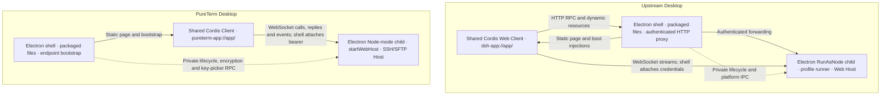

# Desktop Architecture Comparison — 2026-09-30

[中文版本](2026-09-30-desktop-architecture-comparison_zh.md)

PureTerm still follows upstream's core architecture: an Electron shell, a separate Electron Node-mode Host, a shared Web application, and Cordis resource ownership. The main differences are the network protocol and plugin composition; the most useful missing capabilities are quit protection, single-instance ownership, shortcut coordination, and Host failure diagnostics. Background window retention is a product choice, not a prerequisite for this architecture.

## 1. Baselines and scope

| Item | Audited snapshot |
| --- | --- |
| Review date | 2026-09-30, Asia/Shanghai |
| Upstream repository | `D:\bbs\_reference-deepseek-harness`, `master` |
| Latest upstream commit | `639ed015397290b3745d163aafe02ffee4aa3f84`, committed 2026-09-29 17:21:31 +08:00; tag `dsh-v0.2.0-rc.2` |
| Reference update | `git pull --ff-only origin master`; local `HEAD` equals `origin/master` and the remote `master` verified with `git ls-remote`; reference worktree clean |
| PureTerm repository | `D:\bbs\pureterm`, `main` |
| PureTerm commit | `c7816bfbc3a1d1e338bb80d2608ed31152c2ca4a` (release PR #9 merged to `main`), source version `0.1.0-alpha.2` |
| Previous adaptation baseline | Upstream `00102833dfaee1da9f48a3a8eae9d34005a75218`, 2026-09-22 |
| Completed PureTerm migration | `c001b2be5a8bfd360612a3d36e65edf482ecd120`, 2026-09-23, `refactor: align desktop with shared Web Host` |

This is a source comparison of Desktop startup, shared Web/Client composition, transport, authentication, process and window lifecycle, updates, and packaging. Upstream references are pinned to the audited commit. PureTerm references point to repository files at the recorded snapshot. Existing release/version changes were preserved; no runtime migration was performed for this report.

The latest PureTerm release commit changes versions, release documentation, and generated UI metadata. The audited runtime architecture remains the one present at `3c124d0b98db8bbc822c03a70cbc6a65fbb9d23a`.

Classification:

- **Same** means the same responsibility or ownership principle, not identical code or protocol compatibility.
- **Different** means PureTerm implements the concern through another mechanism or deliberately narrower scope.
- **Missing** means upstream has a concrete capability without an equivalent in PureTerm. Its priority depends on SSH/SFTP use, rather than upstream feature count.

## 2. Runtime structure

Both applications load their packaged document while the backend starts. Upstream applies Host boot injections before activating its dynamic Client. PureTerm's Client waits for its loopback WebSocket endpoint and reports application readiness separately from HTML loading. Both standalone Web entries reuse their respective application machinery in ordinary Node; this reuse does not imply that PureTerm Desktop and standalone Web share sessions or data. Evidence: [U01], [U02], [U03], [U04], [P01], [P02], [P03], [P04].

## 3. What is the same

| ID | Architectural principle | Upstream | PureTerm | Assessment |
| --- | --- | --- | --- | --- |
| S01 | Desktop shell and business Host are separate processes | `DesktopHostProcess` starts a Node-mode child and receives readiness/failure facts. [U01] | `startHostProcess()` forks the Host with `ELECTRON_RUN_AS_NODE=1`; the child entry imports no Electron API. [P01], [P02] | Already implemented in the previous migration. |
| S02 | Desktop and Web reuse application assembly | Desktop Host calls the shared `runProfile()` with the `desktop` profile. [U02] | Desktop and standalone Web both call `startWebHost()`. [P02], [P03], [P04] | Same reuse principle; different assembly scale. |
| S03 | The frontend is also a Cordis application | Shared Web boot creates a Client Context and activates plugin entries. [U04] | `createClient()` installs view, transport, terminal, hosts, Keychain, SFTP, monitor, chrome, toasts, and readiness scopes. [P05] | Same dependency and scope model; our Client is not a plain page bolted onto Host. |
| S04 | A stable packaged document starts before Host readiness | `dsh-app://app/` serves the packaged document and waits for boot injections. [U03], [U04] | `pureterm-app://app/` serves packaged UI; bootstrap waits for Host and supplies only the socket URL. [P06], [P07] | Same startup direction; the bootstrap payload differs. |
| S05 | Business requests reach Host through network transport | HTTP RPC and WebSocket streams belong to shared Connection services. [U05], [U06] | SSH/SFTP, hosts, Keychain, and monitoring use the shared WebSocket dispatcher. [P03], [P08] | Same Host boundary, **different physical protocol**. |
| S06 | Desktop authority is owned by the shell | Main owns the Host cookie and attaches it to forwarded HTTP and owned-window WebSocket requests. [U03], [U07] | Main injects a distinct Desktop bearer only into the owned main frame's exact Host socket; browser access has separate token/cookie authentication. [P06], [P09] | Same authority ownership, not identical authentication rules. |
| S07 | Resources and shutdown have explicit owners | Backend start/stop is serialized; Host performs graceful shutdown; updates wait for preparation. [U02], [U08], [U13] | Shell generations, Client scopes, Web Host, and Host expose disposal; accepted storage mutations drain before plugin teardown, and updates wait for Host shutdown. [P03], [P05], [P10], [P11], [P12] | Cleanup already exists; missing task inspection is a separate concern. |

S01–S06 are confirmations of work already completed on September 23, with later SSH/UI additions preserving the boundaries. They are not a new migration required by this upstream update.

## 4. What is different

| ID | Concern | Latest upstream | PureTerm | Reason and implication |
| --- | --- | --- | --- | --- |
| D01 | Product and package scope | General Agent application, profile runner, dynamically activated Host/Client plugins. [U02], [U04] | SSH/SFTP client with two entries and five shared packages: Host, protocol, i18n, transport, UI; static composition. [P03], [P05], [P11] | Deliberate scope. Keep useful Cordis boundaries without importing the full Agent/plugin ecosystem. |
| D02 | Business protocol | Unary RPC posts JSON to HTTP channels; streams use WebSocket. [U05], [U06] | Calls, replies, notices, and events share one WebSocket protocol and dispatcher. [P08], [P13] | The earlier shorthand “both use WebSocket for business” is incomplete. They share the network/Host approach, not an identical transport. No rewrite is justified solely by this difference. |
| D03 | Custom-scheme resource gateway | Static entry/assets come from the package; other application paths proxy to Host with a shell-owned cookie. [U03], [U07] | Custom scheme serves static UI only; business requests connect directly to the exact loopback socket with a shell-injected bearer. [P06], [P07] | Our current feature set does not require an authenticated HTTP/plugin-bundle gateway. This difference predates the new update. |
| D04 | Client bootstrap | Host supplies a boot injection table and dynamic module manifest. [U02], [U04] | Static Client graph plus a validated `webSocketUrl`; readiness is an explicit Client report. [P05], [P07], [P08] | Different plugin needs. Upstream's injection table is not a missing prerequisite for our static Client. |
| D05 | Data and credential policy | Desktop shares session/settings/credential data with CLI under `DSH_HOME`, while executable/plugin profiles are separate. [U00] | Desktop uses its credential provider and system encryption where available; standalone Web has separate stores and session-only secrets. [P02], [P04], [P07] | Intentional SSH data isolation. Do not infer that shared Host/UI means shared storage or cross-entry active SSH sessions. |
| D06 | Native capability bridge | Preload exposes directory/file, shortcut, browser, update, and product shell capabilities. [U07] | Preload exposes bootstrap, readiness, locale reporting, and platform-dependent window controls; private Node RPC handles encryption and native key selection. [P01], [P14] | Same capability-adapter idea with a narrower surface. Upstream is no longer accurately described as having only boot/readiness methods in preload. |
| D07 | Packaging and runtime payload | `asar:true`, selected `asarUnpack`, and additional runtime resources for tools/package management. [U15] | Independent staging with physical production dependencies; `asar:false`; no bundled Python/pnpm tool suite. [P15], [P16] | Both aim for a self-contained install. Different archive layout is not a process-architecture defect. |
| D08 | Window chrome and locale | Windows native title-bar overlay; shell locale also drives account views and richer native menus. [U07] | Windows/Linux render their own caption buttons, macOS keeps native traffic lights; UI locale is reported to native menus/dialogs through the bridge. [P07], [P14], [P17] | Existing adaptation. Localization and platform controls are already present; they are not missing wholesale. |
| D09 | Network reachability | Desktop reports a loopback Host URL, while the shared Web server also permits configured all-interface binding. [U02], [U18] | Both entries enforce `127.0.0.1`; public listening is rejected. [P09] | PureTerm deliberately has a stricter local-only product boundary. Do not copy upstream Web reachability options. |

The HTTP forwarding, backend controller, and single-instance ownership files were already present at the previous upstream baseline. They should not be described as new changes introduced after our September 23 migration.

## 5. What is missing and whether to follow

| ID | Upstream capability | PureTerm's current state and consequence | Applicability and priority |
| --- | --- | --- | --- |
| G01 | Host inspection before ordinary quit; update admission lock, drain, and activity recheck. [U09], [U10], [U13] | Ordinary quit cleans up without querying active SSH work. Update installation confirms restart and stops Host, but lacks an equivalent activity inspection/admission transaction. Existing mutation draining must not be mistaken for this broader guard. [P07], [P11], [P12] | **High.** Define interruption in SSH terms: active connections, pending opens, and unfinished SFTP/exec operations. Preserve the current graceful shutdown, and add the guard through private lifecycle RPC. |
| G02 | Single-instance lock acquired before Desktop profile startup; a second launch focuses the owner. [U11] | No `requestSingleInstanceLock`/`second-instance` ownership path exists. A process's storage queue does not coordinate a second Desktop process using the same directory. [P07], [P11] | **High.** Protect ownership of a Desktop data profile; handle isolated test/custom profiles explicitly. Concurrent-write damage is a risk inferred from the absence of coordination, not a reproduced failure in this review. |
| G03 | Persistent configurable bindings, native input arbitration, composition protection, and overlay coordination. [U12] | Terminal commands are fixed DOM listeners, with native menu handling separate. There is no equivalent shared shortcut registry, editing/revision model, or native arbitration layer. [P18] | **Medium.** Start with clear command ownership across terminal, page, and menu, plus IME protection. Add user-editable bindings only if needed; browser guests/chords need not be copied wholesale. |
| G04 | Serialized backend recovery plus persisted crash reports and explicit restart/exit actions. [U08], [U14] | Unexpected Host exit shows an error and ends the application. Renderer generations and boot diagnostics exist, as do GPU/sandbox startup fallbacks, but there is no equivalent Host fatal recovery/report path. [P01], [P07], [P10] | **Medium.** Add bounded diagnostic retention and a user-visible restart action. Restarting Host cannot by itself restore SSH connections or terminal state. |
| G05 | Closing the workspace hides the same document; Host/tasks stay alive; Windows tray provides a return path. [U07], [U16] | Closing destroys the page. Windows/Linux quit; macOS retains Host, but the socket's disconnect releases the page's SSH sessions. [P07], [P10], [P11] | **Optional product decision.** If PureTerm promises background SSH, retain the document/socket or redesign session ownership. Keeping only Host alive is insufficient. Tray and first-close explanation belong to the same decision. |
| G06 | POSIX GUI launches read the login-shell environment once, with cancellation/deadlines and launcher-owned variable protection. [U17] | Child inherits the GUI environment and removes `NODE_OPTIONS`/`NODE_PATH`. There is no login-shell recovery step. [P01] | **Low for current SSH use; conditional for local tools.** This affects local PATH/tool execution. It does not repair the remote SSH server's shell environment; upstream leaves Windows unchanged. |

The following are also absent, but are outside PureTerm's current product scope:

| Upstream feature family | Assessment for PureTerm |
| --- | --- |
| Desktop-installed CLI with Install/Repair/Remove management. [U19] | Add only if PureTerm gains a standalone terminal command. The Web launcher is not an equivalent CLI installation feature. |
| Account onboarding and embedded Platform views with account-scoped storage. [U07] | PureTerm has no account/platform product. Account-view isolation is not a missing SSH architecture requirement. |
| Dynamic npm plugin management and bundled office/dependency runtimes. [U02], [U04], [U15] | Deliberately outside current scope. Static Cordis composition already meets our feature needs. |
| Agent/subagent jobs, queued messages, and scheduled reminders in quit checks. [U09], [U10] | Borrow the inspection/decision pattern, and implement SSH activity facts rather than importing these services. |
| Product-specific mandatory update policy and analytics coordination. [U07] | PureTerm already has packaged GitHub updates. A centralized service policy is a separate product requirement. |

## 6. Changes since the previous upstream snapshot

| Area | Relationship to `00102833` | What it means for PureTerm |
| --- | --- | --- |
| Shared Node-mode Host, packaged custom-scheme document, HTTP forwarding | Core structure remains; `web-document.ts` is unchanged across the audited range. | Preserve the architecture already migrated; the new version does not require another foundational rewrite. |
| Background close, tray, quit inspection | Added since the baseline; `4745934683` and later fixes implement the new policy. | Evaluate G01 and G05 separately: quit safety is useful even without background retention. |
| Update admission control | The lock/drain/recheck flow already existed; the activity predicate was extracted for reuse by ordinary quit. | G01 combines a new ordinary-quit check with an older update guard that PureTerm still lacks. |
| Desktop shortcut ownership | `keyboard.ts` and `keybindings.ts` added since the baseline; related commits include `91423ea1b4` and `6a82709a2b`. | G03 is a relevant incremental improvement for a terminal application. |
| Login-shell environment | Added in the update merged as `4f26143bf2`. | G06 matters when local tools depend on shell configuration. |
| CLI command management | New installation/management modules in this range. | Product expansion, not a missing foundation for SSH/SFTP. |
| Single-instance lock and backend recovery | Existing baseline capabilities; `single-instance.ts` and `backend-controller.ts` are unchanged in this range. | G02/G04 are older adaptations we did not fully follow, rather than newly introduced drift. |
| Embedded account storage/client metadata | Platform-view and metadata behavior changed. | Relevant only if PureTerm introduces an account/embedded platform feature. |

Upstream's README still contains an older “last window closes” lifecycle statement under technical decisions. For ordinary workspace closing, this report follows the actual `main.ts` close handler and its explicit closing/quitting documentation: close hides the document; actual quit stops Host. Welcome/update/system-shutdown paths have separate handling. [U00], [U07]

## 7. Suggested next changes

These are recommendations from the comparison, not approved implementation work.

1. **Quit protection and data-profile ownership:** define SSH interruption facts, cover ordinary exit and update handoff, and prevent a second Desktop writer for the same profile. Acceptance should include pending handshakes, an unfinished transfer, repeated quit requests, cancellation, and inspection failure.
2. **Shortcut ownership and Host diagnostics:** coordinate terminal/page/native-menu commands and IME input; retain useful failure diagnostics and offer explicit restart. Validate that restart does not imply session restoration.
3. **Choose close behavior:** retain current close-to-release behavior with clear expectations, or implement background retention together with the document/socket lifetime and a reliable return path.
4. **Keep existing boundaries:** static composition, WebSocket business protocol, separate Web credentials, and current packaging remain valid. Login-shell recovery, CLI registration, dynamic plugins, and Platform integration should follow demonstrated product needs.

## 8. Evidence and verification limits

The comparison follows executable entry points and actual handlers; README statements alone do not establish parity. “Missing” findings were checked against the Desktop source tree, shared transport, and relevant Client services. Prior test results were not reused as results from this review.

Updating the reference and writing this report do not qualify either application's runtime, installed updates, signing, or cross-platform behavior. No new SSH feature or Desktop behavior was implemented.

Documentation verification passed: `npm run release:check`, `git diff --check`, and a manual link audit assisted by a one-off Node check. The audit checked all six edited/added Markdown files as UTF-8, 60 relative links, 40 pinned upstream source links against the updated checkout, and matching bilingual finding IDs/baseline metadata. The 23 pre-existing release/version files retained their original content hashes; the concurrent release commit and merge were preserved. The added reports were also checked for whitespace and balanced code fences. No product runtime tests were run for this documentation-only change.

[U00]: https://github.com/deepseek-ai/deepseek-harness/blob/639ed015397290b3745d163aafe02ffee4aa3f84/apps/desktop/README.md
[U01]: https://github.com/deepseek-ai/deepseek-harness/blob/639ed015397290b3745d163aafe02ffee4aa3f84/apps/desktop/src/host-process.ts
[U02]: https://github.com/deepseek-ai/deepseek-harness/blob/639ed015397290b3745d163aafe02ffee4aa3f84/apps/desktop-host/src/index.ts
[U03]: https://github.com/deepseek-ai/deepseek-harness/blob/639ed015397290b3745d163aafe02ffee4aa3f84/apps/desktop/src/web-document.ts
[U04]: https://github.com/deepseek-ai/deepseek-harness/blob/639ed015397290b3745d163aafe02ffee4aa3f84/packages/client/web/src/boot.ts
[U05]: https://github.com/deepseek-ai/deepseek-harness/blob/639ed015397290b3745d163aafe02ffee4aa3f84/packages/client/connection/src/client/rpc.ts
[U06]: https://github.com/deepseek-ai/deepseek-harness/blob/639ed015397290b3745d163aafe02ffee4aa3f84/packages/client/connection/src/client/index.ts
[U07]: https://github.com/deepseek-ai/deepseek-harness/blob/639ed015397290b3745d163aafe02ffee4aa3f84/apps/desktop/src/main.ts
[U08]: https://github.com/deepseek-ai/deepseek-harness/blob/639ed015397290b3745d163aafe02ffee4aa3f84/apps/desktop/src/backend-controller.ts
[U09]: https://github.com/deepseek-ai/deepseek-harness/blob/639ed015397290b3745d163aafe02ffee4aa3f84/apps/desktop/src/quit-confirmation.ts
[U10]: https://github.com/deepseek-ai/deepseek-harness/blob/639ed015397290b3745d163aafe02ffee4aa3f84/apps/desktop-host/src/quit-inspection.ts
[U11]: https://github.com/deepseek-ai/deepseek-harness/blob/639ed015397290b3745d163aafe02ffee4aa3f84/apps/desktop/src/single-instance.ts
[U12]: https://github.com/deepseek-ai/deepseek-harness/blob/639ed015397290b3745d163aafe02ffee4aa3f84/apps/desktop/src/keyboard.ts
[U13]: https://github.com/deepseek-ai/deepseek-harness/blob/639ed015397290b3745d163aafe02ffee4aa3f84/apps/desktop-host/src/update-tasks.ts
[U14]: https://github.com/deepseek-ai/deepseek-harness/blob/639ed015397290b3745d163aafe02ffee4aa3f84/apps/desktop/src/fatal-recovery.ts
[U15]: https://github.com/deepseek-ai/deepseek-harness/blob/639ed015397290b3745d163aafe02ffee4aa3f84/apps/desktop/scripts/electron-builder-config.mjs
[U16]: https://github.com/deepseek-ai/deepseek-harness/blob/639ed015397290b3745d163aafe02ffee4aa3f84/apps/desktop/src/tray.ts
[U17]: https://github.com/deepseek-ai/deepseek-harness/blob/639ed015397290b3745d163aafe02ffee4aa3f84/apps/desktop/src/login-shell-environment.ts
[U18]: https://github.com/deepseek-ai/deepseek-harness/blob/639ed015397290b3745d163aafe02ffee4aa3f84/packages/host/webserver/src/index.ts
[U19]: https://github.com/deepseek-ai/deepseek-harness/blob/639ed015397290b3745d163aafe02ffee4aa3f84/apps/desktop/src/command-management.ts
[P01]: ../../apps/desktop/electron/runtime/host-process.ts
[P02]: ../../apps/desktop/electron/host/entry.ts
[P03]: ../../packages/transport/src/web-host.ts
[P04]: ../../apps/web/src/server.ts
[P05]: ../../packages/ui/src/client.ts
[P06]: ../../apps/desktop/electron/runtime/web-document.ts
[P07]: ../../apps/desktop/electron/app/main.ts
[P08]: ../../packages/ui/src/transport.ts
[P09]: ../../packages/transport/src/carrier-http.ts
[P10]: ../../apps/desktop/electron/app/shell.ts
[P11]: ../../packages/host/src/host.ts
[P12]: ../../apps/desktop/electron/runtime/updates.ts
[P13]: ../../packages/protocol/src/protocol.ts
[P14]: ../../apps/desktop/electron/carriers/preload.ts
[P15]: ../../apps/desktop/electron-builder.cjs
[P16]: ../desktop-release.md
[P17]: ../../packages/ui/src/services/chrome.ts
[P18]: ../../packages/ui/src/services/terminal.ts
