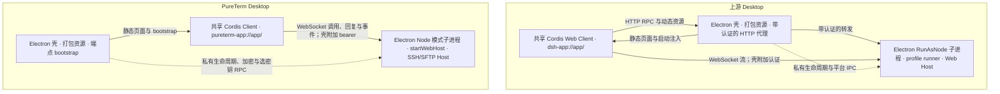

# Desktop 架构对比报告 — 2026-09-30

[English version](2026-09-30-desktop-architecture-comparison.md)

PureTerm 仍沿用上游的核心架构：Electron 桌面壳、独立 Electron Node 模式 Host、共享 Web 应用，以及 Cordis 资源归属模型。主要差异在网络协议和插件组合；最值得补齐的是退出保护、单实例归属、快捷键协调和 Host 故障诊断。关窗后驻留属于产品选择，不是采用这套架构的前提。

## 1. 对比基线与范围

| 项目 | 核对快照 |
| --- | --- |
| 报告日期 | 2026-09-30，Asia/Shanghai |
| 上游仓库 | `D:\bbs\_reference-deepseek-harness`，`master` |
| 最新上游提交 | `639ed015397290b3745d163aafe02ffee4aa3f84`，提交时间 2026-09-29 17:21:31 +08:00；标签 `dsh-v0.2.0-rc.2` |
| 参考副本更新 | 已执行 `git pull --ff-only origin master`；本地 `HEAD`、`origin/master` 和通过 `git ls-remote` 核对的远端 `master` 相同；参考工作树干净 |
| PureTerm 仓库 | `D:\bbs\pureterm`，`main` |
| PureTerm 提交 | `c7816bfbc3a1d1e338bb80d2608ed31152c2ca4a`（发布 PR #9 已合并到 `main`），源码版本 `0.1.0-alpha.2` |
| 上次改造依据 | 上游 `00102833dfaee1da9f48a3a8eae9d34005a75218`，2026-09-22 |
| 已完成的 PureTerm 改造 | `c001b2be5a8bfd360612a3d36e65edf482ecd120`，2026-09-23，`refactor: align desktop with shared Web Host` |

这是一份源码对比，覆盖 Desktop 启动、共享 Web/Client 装配、传输、认证、进程与窗口生命周期、更新和打包。上游证据链接固定到核对提交；PureTerm 链接指向记录快照中的仓库文件。保留了原有版本与发布改动，本次没有进行运行时架构迁移。

PureTerm 最新的发布提交修改了版本、发布文档和生成的 UI 元数据；本次核对的运行时架构仍与 `3c124d0b98db8bbc822c03a70cbc6a65fbb9d23a` 相同。

分类口径：

- **一样**：职责边界或资源归属原则相同，不代表代码相同或协议兼容。
- **不一样**：PureTerm 用另一种机制实现该职责，或主动采用更小的产品范围。
- **缺少**：上游已有具体能力，PureTerm 没有对应实现；是否补齐取决于 SSH/SFTP 场景，不按上游功能数量判断。

## 2. 运行结构

双方都在后台启动期间加载打包页面。上游先应用 Host 提供的启动注入，再激活动态 Client；PureTerm Client 等待本机 WebSocket 端点，并把应用就绪与 HTML 加载完成分开报告。各自的独立 Web 入口都在普通 Node 中复用应用装配；这种复用不代表 PureTerm Desktop 和独立 Web 共享会话或数据。证据：[U01]、[U02]、[U03]、[U04]、[P01]、[P02]、[P03]、[P04]。

## 3. 哪些是一样的

| 编号 | 架构原则 | 上游 | PureTerm | 判断 |
| --- | --- | --- | --- | --- |
| S01 | 桌面壳与业务 Host 分进程 | `DesktopHostProcess` 启动 Node 模式子进程，接收就绪与失败事实。[U01] | `startHostProcess()` 以 `ELECTRON_RUN_AS_NODE=1` 启动 Host；子进程入口不导入 Electron API。[P01]、[P02] | 上次改造已经完成。 |
| S02 | Desktop 与 Web 复用应用装配 | Desktop Host 调用共享 `runProfile()`，选择 `desktop` profile。[U02] | Desktop 和独立 Web 都调用 `startWebHost()`。[P02]、[P03]、[P04] | 复用思路一样，装配规模不同。 |
| S03 | 前端本身也是 Cordis 应用 | 共享 Web 启动流程创建 Client Context，激活插件入口。[U04] | `createClient()` 安装 view、transport、terminal、hosts、Keychain、SFTP、monitor、chrome、toasts、readiness 作用域。[P05] | 依赖与作用域模型一致；我们的 Client 并不是附加在 Host 上的一张普通页面。 |
| S04 | 稳定的打包页面先于 Host 就绪加载 | `dsh-app://app/` 提供打包文档，等待启动注入。[U03]、[U04] | `pureterm-app://app/` 提供打包 UI；bootstrap 等待 Host，只返回 socket URL。[P06]、[P07] | 启动方向一致，bootstrap 内容不同。 |
| S05 | 业务经网络传输到 Host | HTTP RPC 与 WebSocket 流由共享 Connection 服务承担。[U05]、[U06] | SSH/SFTP、主机、Keychain、监控走共享 WebSocket dispatcher。[P03]、[P08] | Host 边界相同，**物理协议不同**。 |
| S06 | 桌面认证由壳持有 | 主进程持有 Host cookie，附加到转发 HTTP 和所属窗口的 WebSocket 请求。[U03]、[U07] | 主进程只向所属主 frame 的精确 Host socket 注入独立 Desktop bearer；浏览器另用 token/cookie。[P06]、[P09] | 认证归属一致，不代表每条认证规则完全相同。 |
| S07 | 资源与退出都有明确的归属 | 后端启动/停止串行化；Host 优雅退出；安装更新等待准备完成。[U02]、[U08]、[U13] | 窗口 generation、Client scope、Web Host 和 Host 都有 dispose；已接受的存储修改在卸载插件前排空，安装更新等待 Host 退出。[P03]、[P05]、[P10]、[P11]、[P12] | 已有资源回收；缺少任务检查是另一个问题。 |

S01–S06 是对 9 月 23 日已完成改造的确认，后续 SSH/UI 功能仍保留这些边界；并不是本轮上游更新要求再做一次改造。

## 4. 哪些是不一样的

| 编号 | 方面 | 最新上游 | PureTerm | 原因与影响 |
| --- | --- | --- | --- | --- |
| D01 | 产品与包规模 | 通用 Agent 应用、profile runner、动态激活的 Host/Client 插件。[U02]、[U04] | SSH/SFTP 客户端，两个入口，五个共享包：Host、protocol、i18n、transport、UI；静态组合。[P03]、[P05]、[P11] | 主动控制范围。保留有用的 Cordis 边界，不需要引入整个 Agent/插件生态。 |
| D02 | 业务协议 | 一次请求对应一次回复的 RPC 用 HTTP POST JSON，流使用 WebSocket。[U05]、[U06] | 调用、回复、notice、event 共用 WebSocket 协议与 dispatcher。[P08]、[P13] | 之前“双方业务都走 WebSocket”的概括不完整。相同的是网络与 Host 思路，不是完全相同的传输；单凭这一差异不需要重写。 |
| D03 | 自定义协议资源入口 | 页面及静态资源从安装包读取，其余应用路径携带壳持有的 cookie 转发到 Host。[U03]、[U07] | 自定义协议只提供静态 UI；业务直接连接精确的本机 socket，由壳注入 bearer。[P06]、[P07] | 当前功能不需要带认证的 HTTP/插件资源代理；这项差异早已存在。 |
| D04 | Client 启动数据 | Host 提供启动注入表与动态模块 manifest。[U02]、[U04] | 静态 Client 图加校验过的 `webSocketUrl`；Client 显式上报就绪。[P05]、[P07]、[P08] | 插件需求不同；注入表并不是我们静态 Client 缺失的前提能力。 |
| D05 | 数据与凭据策略 | Desktop 与 CLI 在 `DSH_HOME` 下共享会话、设置和凭据数据，执行文件/插件 profile 分开。[U00] | Desktop 注入凭据 provider，系统加密可用时持久化；独立 Web 使用独立存储，只在会话内保留秘密。[P02]、[P04]、[P07] | 有意隔离 SSH 数据。共享 Host/UI 不代表共享存储，也不代表不同入口共享活动 SSH 会话。 |
| D06 | 原生能力桥 | Preload 提供目录/文件、快捷键、浏览器、更新及产品壳能力。[U07] | Preload 提供 bootstrap、readiness、语言报告和按平台启用的窗口按钮；私有 Node RPC 承担加密和原生选密钥。[P01]、[P14] | 同样采用能力适配，但表面更小；上游 preload 已不能概括为“只有启动与就绪”。 |
| D07 | 打包与运行时载荷 | `asar:true`、选择性的 `asarUnpack`，以及工具/包管理运行时资源。[U15] | 独立 staging，复制物理生产依赖；`asar:false`；不携带 Python/pnpm 工具套件。[P15]、[P16] | 目标都是完整安装包；归档布局不同不等于进程架构错误。 |
| D08 | 窗口控件与语言 | Windows 使用原生标题栏 overlay；壳语言还同步到账号页面及更丰富的原生菜单。[U07] | Windows/Linux 自绘窗口按钮，macOS 保留系统红绿灯；UI 通过桥把语言报告给原生菜单/弹框。[P07]、[P14]、[P17] | 已有适配；语言切换和平台控件并非整体缺失。 |
| D09 | 网络可达范围 | Desktop 报告本机 Host URL；共享 Web server 也允许配置为监听所有网卡。[U02]、[U18] | 两个入口都强制 `127.0.0.1`，拒绝公开监听。[P09] | PureTerm 主动采用更严格的本机产品边界，不跟随上游 Web 的公开监听选项。 |

HTTP 转发、backend controller 和单实例归属文件在上次上游基线中已存在，不能描述为 9 月 23 日改造之后才出现的新变化。

## 5. 哪些是缺少的，是否值得跟进

| 编号 | 上游能力 | PureTerm 现状与影响 | 适用性与优先级 |
| --- | --- | --- | --- |
| G01 | 普通退出前查询 Host；安装更新前锁住新请求、排空已接受请求并重新检查活动。[U09]、[U10]、[U13] | 普通退出直接清理，不查询活动 SSH 工作。安装更新已有重启确认和 Host 退出，但没有对应的活动检查/请求准入事务；现有存储修改排空不能等同于这套保护。[P07]、[P11]、[P12] | **高。** 按 SSH 定义中断：活动连接、等待中的连接建立、未完成的 SFTP/exec 操作。保留现有优雅退出，通过私有生命周期 RPC 增加检查。 |
| G02 | 在 Desktop profile 启动前获取单实例锁，后续启动聚焦所属实例。[U11] | 没有 `requestSingleInstanceLock`/`second-instance` 归属路径；单进程存储队列不能协调另一个使用同一目录的 Desktop 进程。[P07]、[P11] | **高。** 保护 Desktop 数据 profile 的归属，同时明确隔离测试/自定义 profile。并发写入损坏是根据缺少协调推断的风险，本次没有复现故障。 |
| G03 | 可持久化的自定义绑定、原生输入仲裁、输入法保护及覆盖层协调。[U12] | 终端命令主要是固定 DOM 监听器，原生菜单单独处理；没有统一的快捷键注册、编辑/版本模型和原生仲裁层。[P18] | **中。** 先明确终端、页面、菜单的命令归属并保护 IME；自定义绑定按需增加，浏览器 guest/组合键不必整套复制。 |
| G04 | 串行化的后端恢复、持久化 crash report，以及明确的重启/退出操作。[U08]、[U14] | Host 意外退出时弹错并结束应用；已有 renderer generation、启动诊断和 GPU/sandbox 启动回退，但没有对应的 Host fatal 恢复/报告路径。[P01]、[P07]、[P10] | **中。** 增加有界的故障诊断留存和明确的重启入口；重启 Host 本身不能恢复 SSH 连接与终端状态。 |
| G05 | 关闭工作区时隐藏同一文档，Host/任务持续运行，Windows 托盘提供返回入口。[U07]、[U16] | 关窗销毁页面；Windows/Linux 退出，macOS 保留 Host，但 socket 断开会释放该页面的 SSH 会话。[P07]、[P10]、[P11] | **可选产品决策。** 若承诺后台 SSH，必须保留文档/socket，或重新设计会话归属；只留下 Host 不够。托盘和首次关窗说明应一起决定。 |
| G06 | POSIX GUI 启动时读取一次登录 shell 环境，具备取消/超时和启动器变量保护。[U17] | 子进程继承 GUI 环境，并移除 `NODE_OPTIONS`/`NODE_PATH`；没有恢复登录 shell 环境的步骤。[P01] | **当前 SSH 场景优先级低，依赖本机工具时再评估。** 影响的是本机 PATH/工具执行，不能修复远端 SSH shell 环境；上游 Windows 保持原环境。 |

以下能力也没有，但属于 PureTerm 当前产品范围之外：

| 上游功能族 | 对 PureTerm 的判断 |
| --- | --- |
| Desktop 安装的 CLI，以及安装/修复/移除管理。[U19] | PureTerm 有独立终端命令需求时再增加；Web 启动器不等于 CLI 安装功能。 |
| 账号引导及按账号隔离存储的嵌入 Platform 页面。[U07] | 当前没有账号/平台产品；账号页面隔离不是 SSH 架构缺口。 |
| 动态 npm 插件管理及 Office/依赖运行时套件。[U02]、[U04]、[U15] | 明确不在当前范围；静态 Cordis 组合已经满足现有功能。 |
| Agent/subagent job、待处理消息及退出检查中的定时提醒。[U09]、[U10] | 借鉴“查询事实再决定”的结构，采用 SSH 活动事实，不引入这些服务。 |
| 产品专用的强制更新策略及分析数据协调。[U07] | 已有打包版 GitHub 更新；集中服务策略属于另一个产品需求。 |

## 6. 上次参考版本之后，上游改变了什么

| 方面 | 相对 `00102833` 的变化 | 对 PureTerm 的意义 |
| --- | --- | --- |
| 共享 Node 模式 Host、打包自定义协议页面、HTTP 转发 | 核心结构保留；核对范围内 `web-document.ts` 未变化。 | 保留已完成的架构改造，新版本没有要求再次重做基础架构。 |
| 关窗驻留、托盘、退出检查 | 基线后新增，由 `4745934683` 及后续修正实现新策略。 | 分开评估 G01/G05：不做后台驻留，也值得做退出安全保护。 |
| 安装更新的请求准入控制 | 锁定/排空/重新检查流程原本已有，本轮把活动判断抽出供普通退出复用。 | G01 包含新增加的普通退出检查，以及 PureTerm 仍缺少的既有更新保护。 |
| Desktop 快捷键归属 | 基线后新增 `keyboard.ts`、`keybindings.ts`；相关提交包括 `91423ea1b4`、`6a82709a2b`。 | G03 对终端应用是有价值的增量改进。 |
| 登录 shell 环境 | 在 `4f26143bf2` 合并的更新中新增。 | 本机工具依赖 shell 配置时，G06 才变得重要。 |
| CLI 命令管理 | 本范围内新增安装/管理模块。 | 产品扩展，不是 SSH/SFTP 缺少的基础架构。 |
| 单实例锁及后端恢复 | 基线已有；本范围内 `single-instance.ts`、`backend-controller.ts` 未变化。 | G02/G04 是此前未完全跟随的能力，不是新出现的偏离。 |
| 嵌入账号页面存储/客户端元数据 | Platform view 和元数据行为有变化。 | 只有引入账号/嵌入平台产品后才相关。 |

上游 README 的技术决策部分仍保留了一条较旧的“最后窗口关闭”生命周期说明。对于普通工作区关窗，本报告以实际 `main.ts` close handler 和专门的关窗/退出章节为准：关窗隐藏文档，真正退出才停止 Host；Welcome、更新和系统退出路径另有处理。[U00]、[U07]

## 7. 建议的后续调整顺序

以下是对比后的建议，不代表已获授权的实施工作。

1. **退出保护与数据 profile 归属：** 定义 SSH 中断事实，覆盖普通退出和安装更新交接，阻止同一 profile 的第二个 Desktop 写入者。验收应覆盖等待中的握手、未完成传输、重复退出请求、取消和检查失败。
2. **快捷键归属与 Host 诊断：** 协调终端/页面/原生菜单命令及 IME，留存有用的故障诊断并提供明确的重启操作；验证重启不被解释为会话恢复。
3. **决定关窗行为：** 保留当前关窗释放并清楚说明，或者把后台驻留、文档/socket 生命周期和可靠的返回入口一起实现。
4. **保留已有边界：** 静态组合、WebSocket 业务协议、独立 Web 凭据和现有打包方式仍然合理；登录 shell、CLI 注册、动态插件、Platform 集成依据实际产品需求引入。

## 8. 证据与验证边界

本报告依据可执行入口及实际 handler，不能仅凭 README 说明认定完全一致。“缺少”的判断核对了 Desktop 源码树、共享传输和对应 Client 服务，没有把历史测试结果当成本轮结果。

更新参考副本与编写报告不等于完成任一产品的运行时、安装更新、签名或跨平台验收。本次没有实现新的 SSH 功能或桌面行为。

文档验证通过：`npm run release:check`、`git diff --check`，以及借助一次性 Node 检查的人工链接核对。检查覆盖全部六份新增/修改的 Markdown 的 UTF-8 编码、60 个相对链接、对照已更新副本核实的 40 个固定提交上游源码链接，以及双语条目编号和基线元数据的一致性。原有 23 份版本/发布文件的内容哈希均保持不变，保留了同时进行的发布提交与合并。新增报告也检查了空白和代码围栏配对；本次只有文档变化，没有运行产品运行时测试。

[U00]: https://github.com/deepseek-ai/deepseek-harness/blob/639ed015397290b3745d163aafe02ffee4aa3f84/apps/desktop/README.md
[U01]: https://github.com/deepseek-ai/deepseek-harness/blob/639ed015397290b3745d163aafe02ffee4aa3f84/apps/desktop/src/host-process.ts
[U02]: https://github.com/deepseek-ai/deepseek-harness/blob/639ed015397290b3745d163aafe02ffee4aa3f84/apps/desktop-host/src/index.ts
[U03]: https://github.com/deepseek-ai/deepseek-harness/blob/639ed015397290b3745d163aafe02ffee4aa3f84/apps/desktop/src/web-document.ts
[U04]: https://github.com/deepseek-ai/deepseek-harness/blob/639ed015397290b3745d163aafe02ffee4aa3f84/packages/client/web/src/boot.ts
[U05]: https://github.com/deepseek-ai/deepseek-harness/blob/639ed015397290b3745d163aafe02ffee4aa3f84/packages/client/connection/src/client/rpc.ts
[U06]: https://github.com/deepseek-ai/deepseek-harness/blob/639ed015397290b3745d163aafe02ffee4aa3f84/packages/client/connection/src/client/index.ts
[U07]: https://github.com/deepseek-ai/deepseek-harness/blob/639ed015397290b3745d163aafe02ffee4aa3f84/apps/desktop/src/main.ts
[U08]: https://github.com/deepseek-ai/deepseek-harness/blob/639ed015397290b3745d163aafe02ffee4aa3f84/apps/desktop/src/backend-controller.ts
[U09]: https://github.com/deepseek-ai/deepseek-harness/blob/639ed015397290b3745d163aafe02ffee4aa3f84/apps/desktop/src/quit-confirmation.ts
[U10]: https://github.com/deepseek-ai/deepseek-harness/blob/639ed015397290b3745d163aafe02ffee4aa3f84/apps/desktop-host/src/quit-inspection.ts
[U11]: https://github.com/deepseek-ai/deepseek-harness/blob/639ed015397290b3745d163aafe02ffee4aa3f84/apps/desktop/src/single-instance.ts
[U12]: https://github.com/deepseek-ai/deepseek-harness/blob/639ed015397290b3745d163aafe02ffee4aa3f84/apps/desktop/src/keyboard.ts
[U13]: https://github.com/deepseek-ai/deepseek-harness/blob/639ed015397290b3745d163aafe02ffee4aa3f84/apps/desktop-host/src/update-tasks.ts
[U14]: https://github.com/deepseek-ai/deepseek-harness/blob/639ed015397290b3745d163aafe02ffee4aa3f84/apps/desktop/src/fatal-recovery.ts
[U15]: https://github.com/deepseek-ai/deepseek-harness/blob/639ed015397290b3745d163aafe02ffee4aa3f84/apps/desktop/scripts/electron-builder-config.mjs
[U16]: https://github.com/deepseek-ai/deepseek-harness/blob/639ed015397290b3745d163aafe02ffee4aa3f84/apps/desktop/src/tray.ts
[U17]: https://github.com/deepseek-ai/deepseek-harness/blob/639ed015397290b3745d163aafe02ffee4aa3f84/apps/desktop/src/login-shell-environment.ts
[U18]: https://github.com/deepseek-ai/deepseek-harness/blob/639ed015397290b3745d163aafe02ffee4aa3f84/packages/host/webserver/src/index.ts
[U19]: https://github.com/deepseek-ai/deepseek-harness/blob/639ed015397290b3745d163aafe02ffee4aa3f84/apps/desktop/src/command-management.ts
[P01]: ../../apps/desktop/electron/runtime/host-process.ts
[P02]: ../../apps/desktop/electron/host/entry.ts
[P03]: ../../packages/transport/src/web-host.ts
[P04]: ../../apps/web/src/server.ts
[P05]: ../../packages/ui/src/client.ts
[P06]: ../../apps/desktop/electron/runtime/web-document.ts
[P07]: ../../apps/desktop/electron/app/main.ts
[P08]: ../../packages/ui/src/transport.ts
[P09]: ../../packages/transport/src/carrier-http.ts
[P10]: ../../apps/desktop/electron/app/shell.ts
[P11]: ../../packages/host/src/host.ts
[P12]: ../../apps/desktop/electron/runtime/updates.ts
[P13]: ../../packages/protocol/src/protocol.ts
[P14]: ../../apps/desktop/electron/carriers/preload.ts
[P15]: ../../apps/desktop/electron-builder.cjs
[P16]: ../desktop-release_zh.md
[P17]: ../../packages/ui/src/services/chrome.ts
[P18]: ../../packages/ui/src/services/terminal.ts
