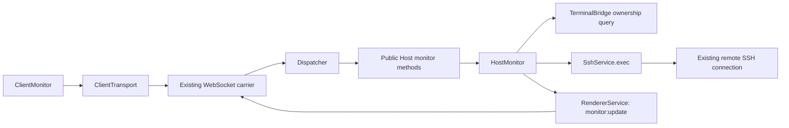

# Session Host Monitoring Design

[中文版本](2026-09-26-session-monitoring-design_zh.md)

**Status:** Proposed implementation baseline, written on 2026-09-26; not implemented by this document. This dated design records the intended change, not current product behavior.

**Execution plan:** [Task-by-task plan](../plans/2026-09-26-session-monitoring.md).

## 1. Intent, scope, and defaults

Show the connected remote host's resource metrics on its connection page. Preserve PureTerm's capability-as-plugin approach: independent Host and Client monitoring plugins, shared SSH connections, public protocol contracts, and scoped cleanup. Monitoring failure must leave the terminal and SFTP usable.

The user requested a document that another agent can implement. The plugin boundaries were discussed; the following MVP details are planning defaults, not additional explicit user requirements. Apply a later user correction to both language versions before implementation:

- Remote target: Linux with a POSIX-compatible command shell, readable `/proc`, and `df -Pk /`. Local Desktop and Web retain their existing supported platforms. Unsupported targets show a local monitoring explanation; they still support SSH.
- Metrics: aggregate CPU utilization, memory used/total, load averages for 1/5/15 minutes, and usage of the filesystem containing `/`.
- Refresh: immediately on activation, then a 5,000 ms delay after each probe finishes. No overlapping probes. CPU needs two successful samples.
- Collect only for the selected, connected tab while the document is visible and the monitor panel is expanded and not manually paused. Default expanded, without stealing terminal focus.
- Keep only the latest snapshot per tab in memory. No historical database, charting library, alerts, remote agent installation, `sudo`, network throughput, process list, or arbitrary mount selection in this increment.

## 2. Existing architecture and extension points

Read [AGENTS.md](../../../AGENTS.md), [architecture](../../architecture.md), [layout decision](../../../LAYOUT-PROPOSAL.md), and [design system](../../design-system.md) before execution. Code inspection baseline: `feat/ui-redesign` at `87ae9e2`; re-check the execution checkout because this is a dated record.

- `packages/host/src/host.ts` assembles Cordis plugins and exposes the public Host API.
- `packages/host/src/services/ssh.ts` already has `exec(sessionId, command, options)`. Its current timeout begins after channel creation, it has no `AbortSignal`, and its byte limit does not cover stderr. Extend this seam before using it for repeated monitoring.
- `packages/host/src/plugins/terminal-bridge.ts` owns the session-to-client mapping. Add a narrow ownership query; do not expose its private map or duplicate ownership in a new registry.
- `packages/transport/src/dispatch.ts` obtains client identity from the carrier. New monitoring requests use this identity, never a client-supplied identity.
- `packages/ui/src/client.ts` statically registers plugins. `ClientTerminal` exposes the selected tab/session and emits session/connection/tab-close events.
- Generic HTTP/WS carriers already carry requests and events. They need no metric-specific logic. Both application entries use the same Host and Client composition.

## 3. Plugin boundaries



`HostMonitor extends Service`, service name `hostMonitor`, injects `ssh`, `terminal`, and `renderer`. It owns subscription policy, scheduling, probe cancellation, Linux collector selection, CPU baselines, and event delivery. Pure parsing/command construction lives in `packages/host/src/monitoring/linux.ts`.

`ClientMonitor extends Service`, service name `clientMonitor`, injects `clientView`, `clientTransport`, and `clientTerminal`. It owns its DOM, expanded/paused state, current subscription generation, last snapshot, and visibility policy. `ClientTerminal`, `ClientSftp`, `ClientChrome`, and `ClientApplication` must not inject `clientMonitor` or wait for a probe. The existing terminal selection API is sufficient; extracting a general workspace service is outside this feature.

Register HostMonitor after its providers and ClientMonitor after ClientTerminal. Add the Client scope name, but do not await its first remote sample in `client.ready`. Constructors must register resources synchronously and catch probe/RPC failures inside the monitor scope. Unloading either monitor plugin must leave unrelated capabilities running. If the Host monitor service is absent, `startMonitor` rejects with `new Error('MONITOR_UNAVAILABLE')`; ClientMonitor renders this exact error as unsupported. `stopMonitor` returns `{ stopped: false }` and Host lifecycle delegation skips the absent service. This differs from a remote non-Linux result, which arrives as an unsupported event after a successful start. Do not dereference a missing service blindly.

## 4. Public contracts

Add these types to the environment-neutral `packages/protocol/src/protocol.ts`; export the same types through the Host package entry where needed. Names below are proposed new interfaces.

```typescript
export interface MonitorStartRequest {
  sessionId: string
  subscriptionId: string
}
export interface MonitorStartResult {
  subscriptionId: string
  intervalMs: 5000
}
export interface MonitorStopResult { stopped: boolean }
export interface MonitorSnapshot {
  collectedAt: number // local Host Unix time in milliseconds
  cpuPercent: number | null
  memory: { usedBytes: number; totalBytes: number; usedPercent: number } | null
  load: { one: number; five: number; fifteen: number } | null
  disk: { mount: '/'; usedBytes: number; totalBytes: number;
    availableBytes: number; usedPercent: number } | null
  issues: Partial<Record<'cpu' | 'memory' | 'load' | 'disk',
    'warming-up' | 'unavailable' | 'invalid-data'>>
}
export interface MonitorUpdate {
  sessionId: string
  subscriptionId: string
  sequence: number
  status: 'ready' | 'partial' | 'unsupported' | 'error'
  snapshot: MonitorSnapshot | null
  message?: string
}
```

Wire/API mapping:

| Wire name | Browser `SshApi.monitor` | Public Host method |
| --- | --- | --- |
| `METHODS.monitorStart = 'monitor:start'` | `start(request: MonitorStartRequest): Promise<MonitorStartResult>` | `startMonitor(request: MonitorStartRequest, clientId: string): Promise<MonitorStartResult>` |
| `METHODS.monitorStop = 'monitor:stop'` | `stop(subscriptionId: string): Promise<MonitorStopResult>` | `stopMonitor(subscriptionId: string, clientId: string): Promise<MonitorStopResult>` |
| `EVENTS.monitorUpdate = 'monitor:update'` | `onUpdate(listener: (update: MonitorUpdate) => void): () => void` | HostMonitor sends through `RendererService` |

The event has one structured payload. Add `parseMonitorUpdate(value: unknown): MonitorUpdate` in protocol, with no imports. Reject malformed identity, sequence, time, non-finite/out-of-range percentages, unsafe/non-integer byte counts, unknown status/issue codes, or invalid nested fields. `sequence` is a positive safe integer, timestamps are non-negative safe integers, load values are finite and non-negative, and `usedPercent` is within 0..100. UI transport catches validation errors and ignores malformed events. A `ready` snapshot has no missing metric; `partial` has at least one available metric; error/unsupported has `snapshot: null`. CPU warm-up is `partial` with `issues.cpu = 'warming-up'`.

Validator oracle: an available metric must have no issue entry; every null metric must have exactly one allowed issue. Only CPU may use `warming-up`. `ready` requires four available metrics and an empty issues object; `partial` requires one to three available metrics. Zero available metrics is represented by `error` with `snapshot: null`, not an all-null partial snapshot. Error/unsupported requires a non-empty message; any provided message is a string of at most 512 characters. Event session/subscription IDs follow the same limits as start requests. Memory/disk totals are positive; used memory cannot exceed total; used/available disk bytes cannot individually exceed total. Render message text as text, never markup.

Dispatcher validates non-empty session IDs up to 128 characters and subscription IDs matching `[A-Za-z0-9_-]{1,64}`. Reject unexpected start fields, including `clientId`, commands, paths, and refresh intervals. UI creates a fresh UUID for every activation. Register its event listener and desired ID before calling start: an event may precede the reply. Never expose arbitrary remote execution through `SshApi`.

Runtime capabilities need no new global Linux flag: support is determined per remote session, not by Desktop versus Web. This is an additive shared contract; update all SshApi fixtures/consumers and both changelogs.

## 5. Subscription, ownership, and cancellation

Add `TerminalBridge.ownsSession(sessionId: string, clientId: string): boolean`, returning true only for a live bridge belonging to that client. HostMonitor checks this and `renderer.isAlive(clientId)` before creating a subscription and before every probe. It injects TerminalBridge for this query; TerminalBridge never injects HostMonitor.

- At most one active monitoring subscription per client, and at most one probe per session. Starting a different valid subscription for a client retires the prior one. Validate ownership before replacing anything. Repeating the same ID/session is idempotent; reusing an active ID for another session is rejected.
- `startMonitor` installs the record and returns without awaiting remote execution. It performs validation/record replacement synchronously before yielding. Records are keyed by client ID with a session ID and subscription ID; requests on one WebSocket cannot reorder asynchronous setup.
- `stopMonitor` only affects the caller's matching ID. An old stop arriving after a new start cannot stop the new subscription. An absent or foreign ID returns `{ stopped: false }` without disclosing its owner. Stop is idempotent and aborts the active exec channel without closing the SSH session.
- Each activation resets CPU history and sequence (first event = 1). Every asynchronous continuation checks record identity, plugin liveness, ownership, and cancellation before publishing or rescheduling.
- `ssh/session-closed`, `Host.releaseClient()`, renderer send failure, monitor scope disposal, and Host disposal retire matching records, clear timers/baselines, and abort pending execs. Host calls `hostMonitor.releaseClient(clientId)` before releasing the client's terminal; this is a small lifecycle delegation, not scheduler logic in the facade.
- Expose `HostMonitor.shutdown(): void` and call it before Host's existing shutdown drain. Its effect cleanup calls the same idempotent shutdown. There must be no pending monitoring timer after disposal.
- Transient probe failures publish `error` and retry after 5,000 ms while eligible. Unsupported OS publishes `unsupported` once and stops automatic probing; manual retry starts a fresh subscription. A field-level failure produces `partial` while other fields remain available. An entirely unusable Linux payload produces `error`.

Extend `SshService.exec` options with `signal?: AbortSignal`. Start the timeout before requesting a channel; reject promptly if already aborted, while opening, or while streaming. A channel arriving after timeout/abort is immediately closed. Count stdout and stderr together against `maxBytes`; exceeding it closes the exec channel and rejects. Remove listeners/timers on every settlement and reject pending execs on SSH session disposal. Preserve UTF-8 decoding and existing callers. Cancellation closes only this exec channel, never `client.end()`, the terminal shell, or SFTP. Closing an SSH channel does not promise that a misbehaving remote process has been killed; bounded read-only commands are still required.

## 6. Linux collection and numeric semantics

One probe uses one fixed, versioned, non-PTY exec command over the established connection, with `timeout: 3000`, `maxBytes: 65536`, and the subscription AbortSignal. No new connection, remote files, background processes, package installation, or credential access. Set `LC_ALL=C`; do not interpolate UI text or host metadata.

Build a constant POSIX shell script using `uname -s`, shell `printf`, reads of `/proc/stat`, `/proc/meminfo`, `/proc/loadavg`, and `df -Pk /`. Use exact versioned section markers (`PURETERM_MONITOR_V1`, `OS`, `CPU`, `MEMORY`, `LOAD`, `DISK`, `END`) and reject missing/duplicate/out-of-order framing. Print only the aggregate `cpu` row and `MemTotal`/`MemAvailable` lines, using shell `read`/`case` or fixed `awk` filters; do not emit the full CPU table on large machines. Each section ends with its exit status so a failed command cannot impersonate a successful empty measurement. A non-Linux OS ends cleanly after its OS section and final marker. Remote shell banners before the frame may be skipped within the total byte bound; duplicate frames are invalid. Treat truncated output, unexpected nonzero overall exit, or a signal as a failed probe; an omitted SSH exit status is acceptable only with complete successful framing.

Export `LINUX_MONITOR_COMMAND: string` as the complete fixed script passed directly to `SshService.exec`, beginning with `LC_ALL=C; export LC_ALL`. Do not add another dynamic `sh -c` quoting layer. Supported remote login shells must accept this POSIX script; a shell that cannot run it produces a monitoring error, not an invented OS diagnosis. Each section marker occupies one exact line; payload follows until an exact `STATUS <decimal exit code>` line (integer 0..255). The parser accepts LF or CRLF. `OS` must have exactly one non-empty payload line and status 0. Linux sections always appear in the order below, including failed ones; failed section payload is ignored and the metric becomes unavailable. Command-level success requires a complete frame, while individual field commands may fail. No nonblank content is allowed after END; only prefix lines before the first frame may be ignored. A canonical Linux frame with an unavailable load field is:

```text
PURETERM_MONITOR_V1
OS
Linux
STATUS 0
CPU
cpu 150 0 150 900 0 0 0 0 0 0
STATUS 0
MEMORY
MemTotal: 1000 kB
MemAvailable: 400 kB
STATUS 0
LOAD
STATUS 1
DISK
Filesystem 1024-blocks Used Available Capacity Mounted on
/dev/root 100 40 50 45% /
STATUS 0
END
```

For a successfully detected non-Linux OS, only this shortened form is valid (OS name varies):

```text
PURETERM_MONITOR_V1
OS
Darwin
STATUS 0
END
```

Parse in Node, with pure functions; do not scrape localized `top`, `free`, or terminal output. The underlying counters/fields are documented in the [Linux kernel `/proc` reference](https://docs.kernel.org/filesystems/proc.html). The calculations and fallback policy below are this design's choices:

| Metric | Defined calculation / unavailable behavior |
| --- | --- |
| CPU | Parse the first eight aggregate counters as non-negative integers: user, nice, system, idle, iowait, irq, softirq, steal; do not add guest columns. Use BigInt internally. `total = sum(eight)` and `idleLike = idle + iowait`; percent = `100 * (deltaTotal - deltaIdleLike) / deltaTotal`. First sample, nonpositive deltaTotal, decreased counters, or invalid deltas reset the baseline and return null. No made-up zero utilization. |
| Memory | Require valid `MemTotal > 0` and `0 <= MemAvailable <= MemTotal`. Convert kB to bytes with `* 1024`; used = total - available; percent = used/total * 100. Missing MemAvailable yields null; do not substitute MemFree. |
| Load | First three `/proc/loadavg` values, without converting them to percentages or assuming core count. |
| Root disk | Parse the single data row for mount `/` from `df -Pk /`, with whitespace-tolerant extraction from the right. Convert 1,024-byte block counts to bytes. `usedPercent = used / (used + available) * 100`; require positive denominator and valid non-negative safe integers. Reserved blocks mean used + available need not equal total. Unsupported/malformed output yields null for disk only. |

Internal parser interface: `parseLinuxProbe(stdout: string): LinuxProbe`; `LinuxProbe` has `os: string`, `cpu: CpuCounters | null`, `memory: MonitorSnapshot['memory']`, `load: MonitorSnapshot['load']`, `disk: MonitorSnapshot['disk']`, and `issues: MonitorSnapshot['issues']`. `CpuCounters` is a readonly eight-element BigInt tuple. `toMonitorSnapshot(probe: LinuxProbe, previousCpu: CpuCounters | null, collectedAt: number): MonitorSnapshot` computes CPU and copies other fields. HostMonitor keeps the current valid CPU tuple for the next successful probe; reset it after any whole-probe failure or interruption.

All wire bytes must fit safe JavaScript integers; overflow is unavailable, not a rounded number. Do not emit BigInt on the wire. Clamp only tiny floating-point rounding at the final percentage boundary; reject malformed inputs instead of hiding them. Values describe what the remote login environment exposes; container `/proc` visibility is not a claim of container quota utilization.

The [ssh2 channel API](https://github.com/mscdex/ssh2#channel) documents distinct exec channels and optional exit events. Test channel behavior using the installed dependency, rather than assuming every server emits an exit code.

## 7. Connection-page presentation

Place a dedicated `#session-monitor` mount between `.session-toolbar` and `.session-content` inside `#session-workspace`. The monitor plugin creates/removes its own children. A compact row shows CPU, memory, load, and root disk, plus last-update state and native-button controls for collapse, pause/resume, and retry. Expand/collapse uses `aria-expanded`; values have readable labels and units. Keep focus on the terminal during background updates and avoid announcing every sample with `aria-live`.

Use existing typography, color, spacing, and motion tokens. Extend `styles/terminal.css` for this session component; do not invent a new palette or add charts. Preserve the existing column-flex `.session-workspace`: give the monitor `flex: 0 0 auto` and keep `.session-content` at `flex: 1 1 auto; min-height: 0`, with its existing terminal/SFTP grid inside. At narrow widths, wrap values without horizontal page overflow. The existing terminal ResizeObserver handles resizing.

UI states: connecting/no session (no collection), loading, ready, partial/warming-up, paused, unsupported, error, disconnected, and stale. Preserve the last successful values for the owning tab only. While actively collecting, mark them stale after 15,000 ms without an accepted snapshot; check the timestamp immediately when visibility returns. Explicit pause/background/collapse shows a paused state instead of pretending the old sample is live. A retry or reconnection resets the CPU baseline. A new session ID never inherits the old session's live status.

Subscribe to existing session/connection/tab-close and transport-loss events plus document `visibilitychange`. A hidden document, another selected tab, library page, collapse, or manual pause retires the current subscription. Returning starts a new ID if eligible. Ignore events whose session ID, subscription ID, or sequence is no longer current. Clear timers, listener disposers, per-tab snapshots on tab close, and all state on plugin disposal. If a start reply arrives after eligibility was lost, issue an idempotent stop for that obsolete ID.

## 8. Acceptance criteria

1. Linux metrics appear on the active connected page through both shared application entry paths, without another SSH authentication or terminal input injection.
2. Defined calculations are proved by fixed fixtures, including CPU warm-up/reset, unavailable fields, reserved disk blocks, overflow, malformed output, and non-Linux targets.
3. Slow probes never overlap. Timeout, byte limit, and cancellation work before channel creation and during output, including stderr-only output.
4. Another client cannot start/receive/stop monitoring for a session it does not own. Invalid requests do not replace a valid subscription.
5. Switching A to B, rapid pause/resume, delayed starts/events, WebSocket loss, tab closure, dependency unload, and remount leave no stale updates, duplicate timers, listeners, or exec channels.
6. A monitor error or monitor plugin removal leaves terminal typing, output, resizing, and SFTP functional. Application readiness never waits for remote monitoring.
7. The panel is usable with keyboard, narrow layout, both themes/densities, and simultaneous SFTP. No continuous screen-reader announcements or focus theft.
8. Existing boundary checks, full `npm run verify`, required Electron verification, bilingual current documentation, changelogs, and generated changelog metadata are updated and pass. Record actual commands/results; this design's checkboxes are not evidence of implementation.

## 9. Handoff limits

Execute the paired plan, not the conversation summary. Retain the above defaults unless the user changes them. Keep dynamic plugin management, a general dashboard framework, a global navigation rewrite, persistence, and unrelated authorization changes out of this increment. Log any necessary interface adjustment in both documents before dependent tasks consume it. Current architecture documentation changes only when implementation actually lands; this document alone must not advertise a shipped feature.
