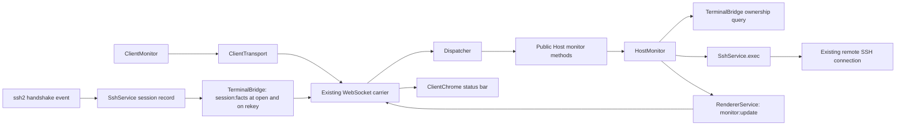

# Session Host Monitoring Design

[中文版本](2026-09-26-session-monitoring-design_zh.md)

**Status:** Proposed implementation baseline, written on 2026-09-26; not implemented by this document. This dated design records the intended change, not current product behavior.

**Execution plan:** [Task-by-task plan](../plans/2026-09-26-session-monitoring.md).

## 1. Intent, scope, and defaults

Show the connected remote host's resource metrics on its connection page. Preserve PureTerm's capability-as-plugin approach: independent Host and Client monitoring plugins, shared SSH connections, public protocol contracts, and scoped cleanup. Monitoring failure must leave the terminal and SFTP usable.

The user requested a document that another agent can implement. The plugin boundaries were discussed; the following MVP details are planning defaults, not additional explicit user requirements, **except** where marked as a user decision below. A 2026-09-26 correction is now folded in: network throughput, remote host uptime, and the negotiated-cipher / host-key facts were originally out of scope because the Host exposed nothing to build them from, and the user has since asked for them. Three choices in that expansion are explicit user decisions rather than planning defaults — uptime means the remote host's uptime and not the session's, throughput sums every non-loopback interface, and the handshake facts get their own channel instead of riding a snapshot. Apply a later user correction to both language versions before implementation:

- Remote target: Linux with a POSIX-compatible command shell, readable `/proc`, and `df -Pk /`. Local Desktop and Web retain their existing supported platforms. Unsupported targets show a local monitoring explanation; they still support SSH.
- Polled metrics: aggregate CPU utilization, memory used/total, load averages for 1/5/15 minutes, usage of the filesystem containing `/`, remote host uptime, and network throughput as a receive/transmit byte rate summed over every non-loopback interface.
- Session facts, which are not metrics and are not polled: the negotiated cipher and the server host key algorithm. They are fixed for the life of a connection and are re-emitted on rekey, so they travel on their own channel rather than inside a snapshot (section 4).
- Refresh: immediately on activation, then a 5,000 ms delay after each probe finishes. No overlapping probes. CPU and network throughput each need two successful samples, because both are deltas.
- Collect only for the selected, connected tab while the document is visible and the monitor panel is expanded and not manually paused. Because the panel starts collapsed, a freshly opened session collects nothing until the user expands it; expanding never steals terminal focus, and collapsing retires the subscription rather than leaving it running invisibly.
- Keep only the latest snapshot per tab in memory. No historical database, charting library, alerts, remote agent installation, `sudo`, process list, or arbitrary mount selection in this increment.

## 2. Existing architecture and extension points

Read [AGENTS.md](../../../AGENTS.md), [architecture](../../architecture.md), [layout decision](../../../LAYOUT-PROPOSAL.md), and [design system](../../design-system.md) before execution. Code inspection baseline: `feat/ui-redesign` at `87ae9e2`; re-check the execution checkout because this is a dated record. The monitoring documents themselves landed on top of that baseline at `a305810`.

- `packages/host/src/host.ts` assembles Cordis plugins and exposes the public Host API.
- `packages/host/src/services/ssh.ts` already has `exec(sessionId, command, options)`. Its current timeout begins after channel creation, it has no `AbortSignal`, and its byte limit does not cover stderr. Extend this seam before using it for repeated monitoring. Measured on the current tree: `exec` has **no caller anywhere in the repository**, and `ExecResult.truncated` is produced and never read, so the stricter failure mode in Task 2 breaks nothing and the flag can be retired instead of preserved.
- `SshSessionInfo` is `{id, host, port, username}` and the negotiated handshake result is read by no code today. That, and not a limitation of ssh2, is why the status bar's cipher and host-key cells were left empty — see `docs/superpowers/plans/2026-09-24-chrome-rebuild.md`, which recorded them as "not available anywhere" and correctly attributed it to the absence of a reader. ssh2 does expose them: `client.on('handshake', (negotiated: NegotiatedAlgorithms) => void)` is typed at `@types/ssh2` line 427, the payload interface is at line 2328, and it carries `kex`, `serverHostKey`, and per-direction `cs`/`sc` cipher, mac, compression and lang. It fires once per handshake and again on every rekey. Verified against the loopback fixture: `{kex: 'curve25519-sha256@libssh.org', serverHostKey: 'rsa-sha2-512', cs: {cipher: 'aes128-gcm@openssh.com', …}}`. This needs no new dependency, no remote command and no polling.
- Two limits on that payload are worth recording, because they decide the shape of `SessionFacts`. First, the prototype's status bar constrains the readers: its cell reads `chacha20-poly1305 · ed25519 · 128 行`, which is cipher, host key and terminal size, so `kex`, mac, compression and lang have no cell and no consumer. Second, the remote software token is not reachable through a typed client API at all — the client-side `Header` is only handed to `Protocol`'s `onHeader` callback, and `Client` keeps the value privately as `this._remoteVer = header.versions.software` (`node_modules/ssh2/lib/client.js:318`), so carrying it would mean reading a private field. `SessionFacts` therefore carries the cipher and the host key algorithm only, and no `kex` and no `software`.
- `packages/host/src/plugins/terminal-bridge.ts` owns the session-to-client mapping. Add a narrow ownership query; do not expose its private map or duplicate ownership in a new registry.
- `packages/transport/src/dispatch.ts` obtains client identity from the carrier. New monitoring requests use this identity, never a client-supplied identity.
- `packages/ui/src/client.ts` statically registers plugins. `ClientTerminal` exposes the selected tab/session and emits session/connection/tab-close events.
- `apps/desktop/tests/fake-ssh-server.mjs` handles `pty`, `window-change`, `sftp` and `shell`, and has **no `exec` handler at all** — an `exec` against it fails with `CHANNEL_FAILURE`. Task 2 must add it before anything downstream can be tested against the fixture, so that extension is a hard prerequisite rather than a parallel-izable detail.
- Generic HTTP/WS carriers already carry requests and events. They need no metric-specific logic. Both application entries use the same Host and Client composition.

## 3. Plugin boundaries



`HostMonitor extends Service`, service name `hostMonitor`, injects `ssh`, `terminal`, and `renderer`. It owns subscription policy, scheduling, probe cancellation, Linux collector selection, CPU and network baselines, and event delivery. Pure parsing/command construction lives in `packages/host/src/monitoring/linux.ts`.

`SshService` owns each connection, so it owns that connection's handshake result: it subscribes to `client.on('handshake')` on the client it creates and keeps the latest `NegotiatedAlgorithms` on that session's record. No other module reads ssh2's negotiated state, for the same reason no other module reads `TerminalBridge`'s map.

Session facts are deliberately **not** part of `HostMonitor`. Removing the monitoring plugin must leave the status bar's cipher and host-key cells filled, so the facts travel on their own event, emitted by the plugin that already routes sessions to clients — `TerminalBridge`, alongside `terminal:opened`, and again on rekey. The monitor plugin is never the owner of a fact about a session it merely observes. This is also why the facts cannot ride `MonitorUpdate`: they are fixed for the life of a connection, so folding them into a 5,000 ms stream would re-send the same strings forever and make the snapshot's own "every ready field is present" rule mean two different things at once.

`ClientMonitor extends Service`, service name `clientMonitor`, injects `clientView`, `clientTransport`, and `clientTerminal`. It owns its DOM, expanded/paused state, current subscription generation, last snapshot, and visibility policy. `ClientTerminal`, `ClientSftp`, `ClientChrome`, and `ClientApplication` must not inject `clientMonitor` or wait for a probe. `ClientChrome` does consume session facts, but through its own path and not through the monitor — neither plugin injects the other. The existing terminal selection API is sufficient; extracting a general workspace service is outside this feature.

Register HostMonitor after its providers and ClientMonitor after ClientTerminal. Add the Client scope name, but do not await its first remote sample in `client.ready`. Constructors must register resources synchronously and catch probe/RPC failures inside the monitor scope. Unloading either monitor plugin must leave unrelated capabilities running, the status bar's session facts among them — those are not a monitoring concern and must not be torn down with the monitor. If the Host monitor service is absent, `startMonitor` rejects with `new Error('MONITOR_UNAVAILABLE')`; ClientMonitor renders this exact error as unsupported. `stopMonitor` returns `{ stopped: false }` and Host lifecycle delegation skips the absent service. This differs from a remote non-Linux result, which arrives as an unsupported event after a successful start. Do not dereference a missing service blindly.

## 4. Public contracts

Add these types to the environment-neutral `packages/protocol/src/protocol.ts`; export the same types through the Host package entry where needed. Names below are proposed new interfaces.

```typescript
export interface MonitorStartRequest {
  sessionId: string
  subscriptionId: string
}
export interface MonitorStartResult {
  subscriptionId: string
  intervalMs: 5000
}
export interface MonitorStopResult { stopped: boolean }
export interface MonitorSnapshot {
  collectedAt: number // local Host Unix time in milliseconds
  cpuPercent: number | null
  memory: { usedBytes: number; totalBytes: number; usedPercent: number } | null
  load: { one: number; five: number; fifteen: number } | null
  disk: { mount: '/'; usedBytes: number; totalBytes: number;
    availableBytes: number; usedPercent: number } | null
  net: { receivedBytesPerSecond: number; transmittedBytesPerSecond: number } | null
  uptimeSeconds: number | null
  issues: Partial<Record<'cpu' | 'memory' | 'load' | 'disk' | 'net' | 'uptime',
    'warming-up' | 'unavailable' | 'invalid-data'>>
}
export interface MonitorUpdate {
  sessionId: string
  subscriptionId: string
  sequence: number
  status: 'ready' | 'partial' | 'unsupported' | 'error'
  snapshot: MonitorSnapshot | null
  message?: string
}
export interface SessionFacts {
  sessionId: string
  /** Increments per session on every handshake, so a rekey supersedes an earlier set. */
  revision: number
  serverHostKey: string
  cipher: { clientToServer: string; serverToClient: string }
}
```

`SessionFacts` carries only what the status bar renders, which is the discipline the omitted fields are held to as well: the MAC and compression algorithms, `kex` and the remote software token all arrive in the same payload or from the same connection, and none of them has a consumer, and a field with no reader is a field no test can hold honest. The cipher keeps both directions rather than the single value the prototype prints, because SSH negotiates the two directions independently and a one-sided field could not report a connection where they differ; section 7 says how the cell renders that case. `serverHostKey` is the algorithm name ssh2 negotiated, not a fingerprint, and the fingerprint the user already approves during TOFU stays where it is, in `known_hosts`.

Wire/API mapping:

| Wire name | Browser `SshApi.monitor` | Public Host method |
| --- | --- | --- |
| `METHODS.monitorStart = 'monitor:start'` | `start(request: MonitorStartRequest): Promise<MonitorStartResult>` | `startMonitor(request: MonitorStartRequest, clientId: string): Promise<MonitorStartResult>` |
| `METHODS.monitorStop = 'monitor:stop'` | `stop(subscriptionId: string): Promise<MonitorStopResult>` | `stopMonitor(subscriptionId: string, clientId: string): Promise<MonitorStopResult>` |
| `EVENTS.monitorUpdate = 'monitor:update'` | `onUpdate(listener: (update: MonitorUpdate) => void): () => void` | HostMonitor sends through `RendererService` |
| `EVENTS.sessionFacts = 'session:facts'` | `onSessionFacts(listener: (facts: SessionFacts) => void): () => void` | TerminalBridge sends through `RendererService` at open and on rekey |

`session:facts` is an event and not a method: there is nothing for the client to ask, and the facts exist whether or not any client wanted them. It is emitted only to the client that owns the session, on the same routing `terminal:opened` already uses, and it is emitted again on rekey with a higher `revision`. A client that has not yet seen `terminal:opened` may still receive facts, because the handshake completes before the session becomes usable; the client buffers by `sessionId` and drops facts for a session it never sees open.

The monitor event has one structured payload. Add `parseMonitorUpdate(value: unknown): MonitorUpdate` in protocol, with no imports. Reject malformed identity, sequence, time, non-finite/out-of-range percentages, unsafe/non-integer byte counts, unknown status/issue codes, or invalid nested fields. `sequence` is a positive safe integer, timestamps are non-negative safe integers, load values are finite and non-negative, and `usedPercent` is within 0..100. UI transport catches validation errors and ignores malformed events. A `ready` snapshot has no missing metric; `partial` has at least one available metric; error/unsupported has `snapshot: null`. CPU and network warm-up are both `partial` with `issues.cpu` and `issues.net` respectively set to `'warming-up'`.

Validator oracle: an available metric must have no issue entry; every null metric must have exactly one allowed issue. Only CPU and network may use `warming-up`, because they are the only two that are deltas of two samples. `ready` requires six available metrics and an empty issues object; `partial` requires one to five available metrics. Zero available metrics is represented by `error` with `snapshot: null`, not an all-null partial snapshot. Error/unsupported requires a non-empty message; any provided message is a string of at most 512 characters. Event session/subscription IDs follow the same limits as start requests. Memory/disk totals are positive; used memory cannot exceed total; used/available disk bytes cannot individually exceed total; `receivedBytesPerSecond` and `transmittedBytesPerSecond` are finite and non-negative; `uptimeSeconds` is a non-negative finite number. Render message text as text, never markup.

Add `parseSessionFacts(value: unknown): SessionFacts` beside it, with the same no-imports rule. It rejects a missing or malformed `sessionId`, a `revision` that is not a positive safe integer, and any of the three algorithm strings being empty, non-string, or longer than 128 characters. Algorithm names are additionally held to a bounded token charset — letters, digits and the punctuation SSH algorithm names actually use — because a server chooses them and a status bar renders them.

Dispatcher validates non-empty session IDs up to 128 characters and subscription IDs matching `[A-Za-z0-9_-]{1,64}`. Reject unexpected start fields, including `clientId`, commands, paths, and refresh intervals. UI creates a fresh UUID for every activation. Register its event listener and desired ID before calling start: an event may precede the reply. Never expose arbitrary remote execution through `SshApi`.

Runtime capabilities need no new global Linux flag: support is determined per remote session, not by Desktop versus Web. This is an additive shared contract; update all SshApi fixtures/consumers and both changelogs.

## 5. Subscription, ownership, and cancellation

Add `TerminalBridge.ownsSession(sessionId: string, clientId: string): boolean`, returning true only for a live bridge belonging to that client. HostMonitor checks this and `renderer.isAlive(clientId)` before creating a subscription and before every probe. It injects TerminalBridge for this query; TerminalBridge never injects HostMonitor.

- At most one active monitoring subscription per client, and at most one probe per session. Starting a different valid subscription for a client retires the prior one. Validate ownership before replacing anything. Repeating the same ID/session is idempotent; reusing an active ID for another session is rejected.
- `startMonitor` installs the record and returns without awaiting remote execution. It performs validation/record replacement synchronously before yielding. Records are keyed by client ID with a session ID and subscription ID; requests on one WebSocket cannot reorder asynchronous setup.
- `stopMonitor` only affects the caller's matching ID. An old stop arriving after a new start cannot stop the new subscription. An absent or foreign ID returns `{ stopped: false }` without disclosing its owner. Stop is idempotent and aborts the active exec channel without closing the SSH session.
- Each activation resets CPU and network history and sequence (first event = 1). Every asynchronous continuation checks record identity, plugin liveness, ownership, and cancellation before publishing or rescheduling.
- `ssh/session-closed`, `Host.releaseClient()`, renderer send failure, monitor scope disposal, and Host disposal retire matching records, clear timers/baselines, and abort pending execs. Host calls `hostMonitor.releaseClient(clientId)` before releasing the client's terminal; this is a small lifecycle delegation, not scheduler logic in the facade.
- Expose `HostMonitor.shutdown(): void` and call it before Host's existing shutdown drain. Its effect cleanup calls the same idempotent shutdown. There must be no pending monitoring timer after disposal.
- Transient probe failures publish `error` and retry after 5,000 ms while eligible. Unsupported OS publishes `unsupported` once and stops automatic probing; manual retry starts a fresh subscription. A field-level failure produces `partial` while other fields remain available. An entirely unusable Linux payload produces `error`.

Extend `SshService.exec` options with `signal?: AbortSignal`. Start the timeout before requesting a channel; reject promptly if already aborted, while opening, or while streaming. A channel arriving after timeout/abort is immediately closed. Count stdout and stderr together against `maxBytes`; exceeding it closes the exec channel and rejects. Remove listeners/timers on every settlement and reject pending execs on SSH session disposal. Preserve UTF-8 decoding and existing callers. Cancellation closes only this exec channel, never `client.end()`, the terminal shell, or SFTP. Closing an SSH channel does not promise that a misbehaving remote process has been killed; bounded read-only commands are still required. Since `exec` currently has no caller and `ExecResult.truncated` has no reader, prefer rejecting on overflow and deleting the flag over preserving an unused contract.

Session facts have no subscription and no timer, but they are not free of lifecycle. `SshService` attaches one `handshake` listener per connection and must remove it on session disposal, including a failed or abandoned connection, or a reconnecting client accumulates listeners on clients that no longer exist. The stored result is dropped with the session record. `TerminalBridge` sends the facts only while `renderer.isAlive(clientId)` holds and the bridge is still live; a send that fails retires nothing, because the facts are not a subscription and there is nothing to retire. A rekey that arrives after the client's last session closed is dropped rather than buffered. `revision` is per session and monotonic; a client ignores any facts whose `revision` is not greater than the one it already holds for that `sessionId`.

## 6. Linux collection and numeric semantics

One probe uses one fixed, versioned, non-PTY exec command over the established connection, with `timeout: 3000`, `maxBytes: 65536`, and the subscription AbortSignal. No new connection, remote files, background processes, package installation, or credential access. Set `LC_ALL=C`; do not interpolate UI text or host metadata.

Build a constant POSIX shell script using `uname -s`, shell `printf`, reads of `/proc/stat`, `/proc/meminfo`, `/proc/loadavg`, `/proc/net/dev`, `/proc/uptime`, and `df -Pk /`. Use exact versioned section markers (`PURETERM_MONITOR_V1`, `OS`, `CPU`, `MEMORY`, `LOAD`, `DISK`, `NET`, `UPTIME`, `END`) and reject missing/duplicate/out-of-order framing. Print only the aggregate `cpu` row, the `MemTotal`/`MemAvailable` lines, and the `NET`/`UPTIME` values, using shell `read`/`case` or fixed `awk` filters; do not emit the full CPU table or the full interface table on large machines. For `NET`, emit only the summed non-loopback counters as a single `rx tx` pair, so the summation rule lives in one place instead of in both the script and the parser. Each section ends with its exit status so a failed command cannot impersonate a successful empty measurement. A non-Linux OS ends cleanly after its OS section and final marker. Remote shell banners before the frame may be skipped within the total byte bound; duplicate frames are invalid. Treat truncated output, unexpected nonzero overall exit, or a signal as a failed probe; an omitted SSH exit status is acceptable only with complete successful framing.

Export `LINUX_MONITOR_COMMAND: string` as the complete fixed script passed directly to `SshService.exec`, beginning with `LC_ALL=C; export LC_ALL`. Do not add another dynamic `sh -c` quoting layer. Supported remote login shells must accept this POSIX script; a shell that cannot run it produces a monitoring error, not an invented OS diagnosis. Each section marker occupies one exact line; payload follows until an exact `STATUS <decimal exit code>` line (integer 0..255). The parser accepts LF or CRLF. `OS` must have exactly one non-empty payload line and status 0. Linux sections always appear in the order below, including failed ones; failed section payload is ignored and the metric becomes unavailable. Command-level success requires a complete frame, while individual field commands may fail. No nonblank content is allowed after END; only prefix lines before the first frame may be ignored. A canonical Linux frame with an unavailable load field is:

```text
PURETERM_MONITOR_V1
OS
Linux
STATUS 0
CPU
cpu 150 0 150 900 0 0 0 0 0 0
STATUS 0
MEMORY
MemTotal: 1000 kB
MemAvailable: 400 kB
STATUS 0
LOAD
STATUS 1
DISK
Filesystem 1024-blocks Used Available Capacity Mounted on
/dev/root 100 40 50 45% /
STATUS 0
NET
4096 2048
STATUS 0
UPTIME
86400.5
STATUS 0
END
```

For a successfully detected non-Linux OS, only this shortened form is valid (OS name varies):

```text
PURETERM_MONITOR_V1
OS
Darwin
STATUS 0
END
```

Parse in Node, with pure functions; do not scrape localized `top`, `free`, or terminal output. The underlying counters/fields are documented in the [Linux kernel `/proc` reference](https://docs.kernel.org/filesystems/proc.html). The calculations and fallback policy below are this design's choices:

| Metric | Defined calculation / unavailable behavior |
| --- | --- |
| CPU | Parse the first eight aggregate counters as non-negative integers: user, nice, system, idle, iowait, irq, softirq, steal; do not add guest columns. Use BigInt internally. `total = sum(eight)` and `idleLike = idle + iowait`; percent = `100 * (deltaTotal - deltaIdleLike) / deltaTotal`. First sample, nonpositive deltaTotal, decreased counters, or invalid deltas reset the baseline and return null. No made-up zero utilization. |
| Memory | Require valid `MemTotal > 0` and `0 <= MemAvailable <= MemTotal`. Convert kB to bytes with `* 1024`; used = total - available; percent = used/total * 100. Missing MemAvailable yields null; do not substitute MemFree. |
| Load | First three `/proc/loadavg` values, without converting them to percentages or assuming core count. |
| Root disk | Parse the single data row for mount `/` from `df -Pk /`, with whitespace-tolerant extraction from the right. Convert 1,024-byte block counts to bytes. `usedPercent = used / (used + available) * 100`; require positive denominator and valid non-negative safe integers. Reserved blocks mean used + available need not equal total. Unsupported/malformed output yields null for disk only. |
| Network | The `NET` section carries two integers: the sum of `rx` bytes and the sum of `tx` bytes over every interface whose name is not `lo`. Both are cumulative since boot, so a rate needs two samples: `rate = (current - previous) * 1000 / (collectedAt - previousCollectedAt)`. The first sample, a decrease in either counter, or a non-positive elapsed time resets the baseline and yields null — a decrease means an interface was reset or a counter wrapped, and neither is a rate. The two directions are reported separately and never summed into one figure. |
| Host uptime | The first value of `/proc/uptime`, in seconds. It is the host's own figure, so it does not depend on the polling interval or on when the subscription started, and it needs no second sample. Missing, negative, or non-finite output yields null. |

Internal parser interface: `parseLinuxProbe(stdout: string): LinuxProbe`; `LinuxProbe` has `os: string`, `cpu: CpuCounters | null`, `memory: MonitorSnapshot['memory']`, `load: MonitorSnapshot['load']`, `disk: MonitorSnapshot['disk']`, `net: NetCounters | null`, `uptimeSeconds: number | null`, and `issues: MonitorSnapshot['issues']`. `CpuCounters` is a readonly eight-element BigInt tuple; `NetCounters` is a readonly two-element BigInt tuple of received and transmitted bytes. `toMonitorSnapshot(probe: LinuxProbe, previous: PreviousSample | null, collectedAt: number): MonitorSnapshot` computes CPU and network from the baselines and copies the rest, where `PreviousSample` is `{ collectedAt: number; cpu: CpuCounters; net: NetCounters }`. One parameter rather than two, because the two deltas share a single timestamp: a baseline pair from two different moments would silently produce a rate that never happened. HostMonitor keeps the current valid sample for the next successful probe; reset it after any whole-probe failure or interruption, and on every new subscription.

All wire bytes must fit safe JavaScript integers; overflow is unavailable, not a rounded number. Do not emit BigInt on the wire. Clamp only tiny floating-point rounding at the final percentage boundary; reject malformed inputs instead of hiding them. Values describe what the remote login environment exposes; container `/proc` visibility is not a claim of container quota utilization.

The [ssh2 channel API](https://github.com/mscdex/ssh2#channel) documents distinct exec channels and optional exit events. Test channel behavior using the installed dependency, rather than assuming every server emits an exit code.

## 7. Connection-page presentation

Place a dedicated `#session-monitor` mount between `.session-toolbar` and `.session-content` inside `#session-workspace`. The monitor plugin creates/removes its own children. A compact row shows CPU, memory, load, root disk, network receive/transmit and host uptime, plus last-update state and native-button controls for collapse, pause/resume, and retry. Expand/collapse uses `aria-expanded`; values have readable labels and units. Keep focus on the terminal during background updates and avoid announcing every sample with `aria-live`.

**Default collapsed, and this is the one presentation choice the prototype constrains.** The prototype draws two fixed bands on a session screen: its 40px top bar and its 24px status bar. The shipped shell already draws three, because the session toolbar is a deliberate departure — the prototype folds those controls into its top bar. A monitor strip expanded by default makes four, and every one of them comes out of the terminal's height on the screen the user actually types in. Collapsed by default, the row still reports its last-update state and the controls stay reachable, so nothing is hidden that the user cannot reopen in one click; the prototype's proportions hold until someone asks for the numbers.

The prototype has no monitoring region at all — none of its seven screens draws a host metric, and its own status bar is the only place it ever put a live number. So the strip's visual language is borrowed rather than matched: the values take the status bar's idiom (`--fs-micro`, `--tx-3`, `--font-mono` for the figures, a `│` between fields, `--c-chrome` on a `--line` top border), and the controls take the session toolbar's (40px, the existing `.ghost small` button). Do not invent a card, chip or gauge vocabulary: the prototype has no gauge, sparkline or chart anywhere, and this design adds none.

The two session facts the status bar can now fill belong to `ClientChrome`, not to this strip: the negotiated cipher and the server host key algorithm. They arrive on `session:facts`, they never change within a connection, and putting a constant in a polled row would make the row lie about what it is showing. They also fill the prototype's existing cell rather than adding one: the prototype reads `chacha20-poly1305 · ed25519 · 128 行`, whose third item is already the terminal size this shell reports as `status-size`. The cipher cell prints `cipher.clientToServer`, and appends `→ cipher.serverToClient` only when the two directions differ, so the common case matches the prototype exactly and an asymmetric negotiation is not silently rounded to one side. The status bar's third previously-empty cell, session uptime, stays empty: this increment adds the **host's** uptime to the snapshot, which is a different figure, and `ClientChrome` must not present one as the other.

Two existing guards and one comment are affected by this change, and the executor must handle them deliberately rather than delete them:

- `packages/ui/tests/visual-contract.test.mjs` asserts that `.session-content` immediately follows `.session-toolbar` in the markup. Inserting `#session-monitor` between them makes that assertion fail. Widen the pattern to allow the monitor mount and keep asserting what it was written for — that the toolbar is one block above the content — instead of dropping the assertion.
- `packages/ui/src/services/chrome.ts` carries a class comment stating that the Host reports no negotiated cipher, no remote host key type, no session uptime and no transfer rate, and that those slots stay empty rather than plausible. Two of those become false here; rewrite it to say which slots are now filled and which remain empty, so the next reader is not told to leave a filled cell blank.
- `packages/ui/tests/theme-sync.test.mjs` and the stylesheet contract census read the partials by name. `terminal.css` is already in both lists, so extending it needs no registration; a new partial would.

Use existing typography, color, spacing, and motion tokens. Extend `styles/terminal.css` for this session component; do not invent a new palette or add charts. Preserve the existing column-flex `.session-workspace`: give the monitor `flex: 0 0 auto` and keep `.session-content` at `flex: 1 1 auto; min-height: 0`, with its existing terminal/SFTP grid inside. At narrow widths, wrap values without horizontal page overflow. The existing terminal ResizeObserver handles resizing.

UI states: connecting/no session (no collection), loading, ready, partial/warming-up, paused, unsupported, error, disconnected, and stale. Preserve the last successful values for the owning tab only. While actively collecting, mark them stale after 15,000 ms without an accepted snapshot; check the timestamp immediately when visibility returns. Explicit pause/background/collapse shows a paused state instead of pretending the old sample is live. A retry or reconnection resets the CPU and network baselines. A new session ID never inherits the old session's live status.

Subscribe to existing session/connection/tab-close and transport-loss events plus document `visibilitychange`. A hidden document, another selected tab, library page, collapse, or manual pause retires the current subscription. Returning starts a new ID if eligible. Ignore events whose session ID, subscription ID, or sequence is no longer current. Clear timers, listener disposers, per-tab snapshots on tab close, and all state on plugin disposal. If a start reply arrives after eligibility was lost, issue an idempotent stop for that obsolete ID.

## 8. Acceptance criteria

1. Linux metrics appear on the active connected page through both shared application entry paths, without another SSH authentication or terminal input injection.
2. Defined calculations are proved by fixed fixtures, including CPU warm-up/reset, network warm-up, a network counter decrease and a counter wrap, a non-loopback summation that would differ if `lo` were included, host uptime, unavailable fields, reserved disk blocks, overflow, malformed output, and non-Linux targets.
3. Slow probes never overlap. Timeout, byte limit, and cancellation work before channel creation and during output, including stderr-only output.
4. Another client cannot start/receive/stop monitoring for a session it does not own. Invalid requests do not replace a valid subscription. A client that does not own a session receives neither its updates nor its session facts.
5. Switching A to B, rapid pause/resume, delayed starts/events, WebSocket loss, tab closure, dependency unload, and remount leave no stale updates, duplicate timers, listeners, or exec channels.
6. A monitor error or monitor plugin removal leaves terminal typing, output, resizing, and SFTP functional, and leaves the status bar's cipher and host-key cells still filled. Application readiness never waits for remote monitoring. Removing the monitor plugin must not remove a session fact, and removing a session must not leave a `handshake` listener behind on a client the Host has already dropped.
7. The panel is usable with keyboard, narrow layout, both themes/densities, and simultaneous SFTP. No continuous screen-reader announcements or focus theft. A session screen with the monitor untouched has the same band count it had before this feature, and expanding the row does not move focus out of the terminal.
8. The markup guard that pinned `.session-content` to follow `.session-toolbar` still asserts what it was written for, and `ClientChrome`'s class comment no longer tells a reader that two filled slots are empty.
9. Existing boundary checks, full `npm run verify`, required Electron verification, bilingual current documentation, changelogs, and generated changelog metadata are updated and pass. Record actual commands/results; this design's checkboxes are not evidence of implementation. Where the executing environment cannot run `npm run verify:electron`, record the blocker and the evidence that was gathered instead — an unrun check is not a passed check, and saying so is the requirement.

## 9. Handoff limits

Execute the paired plan, not the conversation summary. Retain the above defaults unless the user changes them. Keep dynamic plugin management, a general dashboard framework, a global navigation rewrite, persistence, and unrelated authorization changes out of this increment. The 2026-09-26 expansion added throughput, host uptime and the two handshake facts the status bar renders; it did not add the key-exchange algorithm, the remote software version, the MAC and compression algorithms, a per-interface breakdown, an interface selector, session uptime in the status bar, or SFTP transfer rate. That last one is worth naming, because the prototype's `↓ 0.00 MB/s` cell sits next to `SFTP 会话 1/2` and reads as an SFTP figure, while what this design collects is the host's network throughput — a different quantity, measured at a different layer, and the two must not be presented as one. Log any necessary interface adjustment in both documents before dependent tasks consume it. Current architecture documentation changes only when implementation actually lands; this document alone must not advertise a shipped feature.
