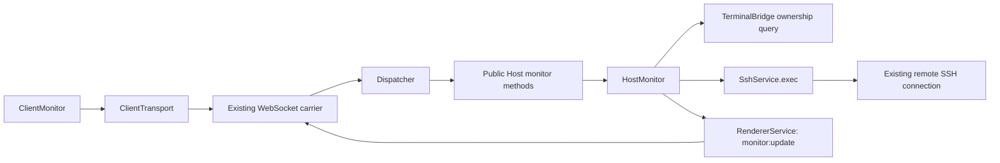

# 会话主机监控设计

[English version](2026-09-26-session-monitoring-design.md)

**状态：**拟议实现基线，撰写于 2026-09-26；本文档并未实现该功能。这份有日期的设计记录了预期变更，不代表产品当前行为。

**执行计划：**[逐项任务计划](../plans/2026-09-26-session-monitoring_zh.md)。

## 1. 意图、范围与默认值

在连接页面显示已连接远程主机的资源指标。保留 PureTerm 以插件提供能力的方式：独立的 Host 和 Client 监控插件、共享 SSH 连接、公开协议契约，以及有作用域的清理。监控失败时，终端和 SFTP 必须仍可用。

用户要求提供一份可供另一位代理实现的文档。插件边界已经讨论过；以下 MVP 细节是规划默认值，并非用户明确提出的额外要求。实现前如用户之后提出修正，应同时应用于两种语言版本：

- 远程目标：Linux，带有兼容 POSIX 的命令 shell、可读取的 `/proc`，以及 `df -Pk /`。本地 Desktop 和 Web 保留现有受支持的平台。对于不受支持的目标，显示本地监控说明；SSH 仍可使用。
- 指标：总体 CPU 利用率、已用/总内存、1/5/15 分钟负载平均值，以及包含 `/` 的文件系统使用率。
- 刷新：激活后立即采集，此后每次探测完成后延迟 5,000 ms 再采集。不得有重叠探测。CPU 需要两个成功样本。
- 仅当所选标签页已连接、文档可见、监控面板展开且未手动暂停时才采集。默认展开，不抢占终端焦点。
- 每个标签页在内存中只保留最新快照。本次增量不包含历史数据库、图表库、告警、远程代理安装、`sudo`、网络吞吐量、进程列表或任意挂载点选择。

## 2. 现有架构与扩展点

执行前阅读 [AGENTS.md](../../../AGENTS.md)、[架构文档](../../architecture.md)、[布局决策](../../../LAYOUT-PROPOSAL.md) 和[设计系统](../../design-system.md)。代码检查基线：`feat/ui-redesign` 分支上的 `87ae9e2`；这是有日期的记录，请在执行检出中重新检查。

- `packages/host/src/host.ts` 负责组装 Cordis 插件并公开 Host API。
- `packages/host/src/services/ssh.ts` 已有 `exec(sessionId, command, options)`。当前超时从 channel 创建后才开始；它没有 `AbortSignal`，字节上限也不涵盖 stderr。在用于重复监控前，应先扩展此接口。
- `packages/host/src/plugins/terminal-bridge.ts` 持有会话到客户端的映射。增加一个范围窄的归属查询；不要公开其私有映射，也不要在新注册表中重复维护归属信息。
- `packages/transport/src/dispatch.ts` 从 carrier 获取客户端身份。新的监控请求使用此身份，绝不使用客户端提供的身份。
- `packages/ui/src/client.ts` 静态注册插件。`ClientTerminal` 暴露所选标签页/会话，并发出会话/连接/标签关闭事件。
- 通用 HTTP/WS carrier 已能承载请求和事件，无需加入特定指标的逻辑。两个应用入口使用相同的 Host 和 Client 组合。

## 3. 插件边界



`HostMonitor extends Service`，服务名为 `hostMonitor`，注入 `ssh`、`terminal` 和 `renderer`。它负责订阅策略、调度、探测取消、Linux 采集器选择、CPU 基线和事件投递。纯解析与命令构造放在 `packages/host/src/monitoring/linux.ts`。

`ClientMonitor extends Service`，服务名为 `clientMonitor`，注入 `clientView`、`clientTransport` 和 `clientTerminal`。它负责自己的 DOM、展开/暂停状态、当前订阅代次、最新快照及可见性策略。`ClientTerminal`、`ClientSftp`、`ClientChrome` 和 `ClientApplication` 不得注入 `clientMonitor` 或等待探测完成。现有终端选择 API 已足够；提取通用 workspace 服务不属于此功能范围。

在其依赖提供方之后注册 HostMonitor，在 ClientTerminal 之后注册 ClientMonitor。添加 Client 作用域名称，但不要在 `client.ready` 中等待第一个远程样本。构造函数必须同步注册资源，并在监控作用域内部捕获探测/RPC 错误。卸载任一监控插件都必须让无关能力继续运行。若 Host 监控服务不存在，`startMonitor` 以 `new Error('MONITOR_UNAVAILABLE')` 拒绝；ClientMonitor 将此精确错误显示为 unsupported。`stopMonitor` 返回 `{ stopped: false }`，Host 生命周期委托跳过缺失的服务。这与远端非 Linux 的结果不同：后者在 start 成功后通过 unsupported 事件返回。不要盲目解引用缺失的服务。

## 4. 公开契约

将以下类型添加到与环境无关的 `packages/protocol/src/protocol.ts`；必要时也通过 Host 包入口导出相同类型。以下名称是拟新增接口。

```typescript
export interface MonitorStartRequest {
  sessionId: string
  subscriptionId: string
}
export interface MonitorStartResult {
  subscriptionId: string
  intervalMs: 5000
}
export interface MonitorStopResult { stopped: boolean }
export interface MonitorSnapshot {
  collectedAt: number // local Host Unix time in milliseconds
  cpuPercent: number | null
  memory: { usedBytes: number; totalBytes: number; usedPercent: number } | null
  load: { one: number; five: number; fifteen: number } | null
  disk: { mount: '/'; usedBytes: number; totalBytes: number;
    availableBytes: number; usedPercent: number } | null
  issues: Partial<Record<'cpu' | 'memory' | 'load' | 'disk',
    'warming-up' | 'unavailable' | 'invalid-data'>>
}
export interface MonitorUpdate {
  sessionId: string
  subscriptionId: string
  sequence: number
  status: 'ready' | 'partial' | 'unsupported' | 'error'
  snapshot: MonitorSnapshot | null
  message?: string
}
```

线路/API 对应关系：

| 线路名称 | 浏览器 `SshApi.monitor` | 公开 Host 方法 |
| --- | --- | --- |
| `METHODS.monitorStart = 'monitor:start'` | `start(request: MonitorStartRequest): Promise<MonitorStartResult>` | `startMonitor(request: MonitorStartRequest, clientId: string): Promise<MonitorStartResult>` |
| `METHODS.monitorStop = 'monitor:stop'` | `stop(subscriptionId: string): Promise<MonitorStopResult>` | `stopMonitor(subscriptionId: string, clientId: string): Promise<MonitorStopResult>` |
| `EVENTS.monitorUpdate = 'monitor:update'` | `onUpdate(listener: (update: MonitorUpdate) => void): () => void` | HostMonitor 通过 `RendererService` 发送 |

事件只有一个结构化负载。在 protocol 中添加 `parseMonitorUpdate(value: unknown): MonitorUpdate`，且不得有任何导入。对于格式错误的身份、序号、时间、非有限值/范围外百分比、不安全或非整数的字节数、未知状态/问题代码或无效嵌套字段，应拒绝解析。`sequence` 是正安全整数，时间戳是非负安全整数，负载值必须有限且非负，`usedPercent` 必须在 0..100 范围内。UI transport 捕获验证错误并忽略格式错误的事件。`ready` 快照的指标不得缺失；`partial` 至少有一个可用指标；error/unsupported 的 `snapshot: null`。CPU 预热状态用 `issues.cpu = 'warming-up'` 表示，并归为 `partial`。

验证器判定规则：可用指标不得包含 issue 项；每个为 null 的指标必须恰有一个允许的 issue。只有 CPU 可以使用 `warming-up`。`ready` 要求四个指标均可用且 issues 对象为空；`partial` 要求一至三个指标可用。零个可用指标应表示为 `snapshot: null` 的 `error`，而不是所有指标均为 null 的 partial 快照。error/unsupported 必须带有非空 message；若提供 message，它必须是长度不超过 512 个字符的字符串。事件中的会话/订阅 ID 与 start 请求遵循相同长度限制。内存/磁盘总量必须为正；已用内存不得超过总量；磁盘已用/可用字节各自不得超过总量。将 message 文本作为文本渲染，绝不可解释为标记语言。

Dispatcher 验证非空会话 ID（最多 128 个字符）以及符合 `[A-Za-z0-9_-]{1,64}` 的订阅 ID。拒绝意外的 start 字段，包括 `clientId`、命令、路径和刷新间隔。UI 每次激活都创建新的 UUID。先注册事件监听器并设置预期 ID，再调用 start：事件可能先于回复到达。绝不可通过 `SshApi` 暴露任意远程执行能力。

运行时能力无需新增全局 Linux 标志：支持情况按远程会话判断，而非按 Desktop/Web 判断。这是一个增量共享契约；更新所有 SshApi fixture/使用方以及两个 changelog。

## 5. 订阅、归属与取消

添加 `TerminalBridge.ownsSession(sessionId: string, clientId: string): boolean`，仅当该客户端拥有仍然有效的 bridge 时返回 true。HostMonitor 在创建订阅前以及每次探测前都检查此项和 `renderer.isAlive(clientId)`。为执行此查询而注入 TerminalBridge；TerminalBridge 不得注入 HostMonitor。

- 每个客户端最多有一个活动监控订阅，每个会话最多有一个探测。客户端启动另一个有效订阅时，旧订阅退役。替换任何内容前先验证归属。重复使用相同 ID/会话时保持幂等；将仍活动的 ID 用于另一会话时应拒绝。
- `startMonitor` 安装记录后立即返回，不等待远程执行。它在让出执行权之前同步完成验证/记录替换。记录以客户端 ID 为键，并包含会话 ID 和订阅 ID；同一 WebSocket 上的请求不能以异步设置乱序。
- `stopMonitor` 只影响调用方匹配的 ID。新 start 之后才到达的旧 stop 不能停止新订阅。不存在或属于其他客户端的 ID 返回 `{ stopped: false }`，不泄露其所有者。stop 幂等，并中止活动 exec channel，但不关闭 SSH 会话。
- 每次激活都会重置 CPU 历史和序号（首个事件 = 1）。每次异步续体在发布或重新调度前都检查记录身份、插件存活状态、归属和取消状态。
- `ssh/session-closed`、`Host.releaseClient()`、renderer 发送失败、监控作用域释放以及 Host 释放，都要退役匹配记录、清除定时器/基线并中止待处理 exec。Host 在释放客户端终端前调用 `hostMonitor.releaseClient(clientId)`；这是一个小型生命周期委托，不是在 facade 中实现调度逻辑。
- 暴露 `HostMonitor.shutdown(): void`，并在 Host 现有关闭清理流程开始前调用。它的 effect cleanup 调用同一个幂等 shutdown。释放后不得有待处理的监控定时器。
- 瞬时探测失败时发布 `error`，并在仍符合条件时于 5,000 ms 后重试。不支持的操作系统发布一次 `unsupported` 后停止自动探测；手动重试会启动新订阅。字段级失败产生 `partial`，同时保留其他字段。整个 Linux 负载均不可用时产生 `error`。

为 `SshService.exec` 选项扩展 `signal?: AbortSignal`。在请求 channel 前启动超时；如果已经中止，则立即拒绝；在打开 channel 期间或数据流传输期间中止也应及时拒绝。超时/中止后才到达的 channel 应立即关闭。stdout 和 stderr 的字节数合并计算 `maxBytes`；超过上限时关闭 exec channel 并拒绝。每种结束路径都移除监听器/定时器，并在 SSH session 释放时拒绝待处理的 exec。保留 UTF-8 解码和现有调用方。取消只关闭此 exec channel，绝不调用 `client.end()`，也不关闭终端 shell 或 SFTP。关闭 SSH channel 并不能保证失控的远程进程已被杀死；因此仍须使用有界的只读命令。

## 6. Linux 采集与数值语义

每次探测都通过已建立的连接执行一个固定、带版本、非 PTY 的命令，使用 `timeout: 3000`、`maxBytes: 65536` 和订阅的 AbortSignal。不得新建连接、远程文件或后台进程，不安装软件包，也不访问凭据。设置 `LC_ALL=C`；不得插入 UI 文本或主机元数据。

构建一个常量 POSIX shell 脚本，使用 `uname -s`、shell `printf`、读取 `/proc/stat`、`/proc/meminfo`、`/proc/loadavg` 和 `df -Pk /`。使用精确且带版本的分节标记（`PURETERM_MONITOR_V1`、`OS`、`CPU`、`MEMORY`、`LOAD`、`DISK`、`END`），并拒绝缺失/重复/顺序错误的帧。仅打印总体 `cpu` 行和 `MemTotal`/`MemAvailable` 行，可使用 shell `read`/`case` 或固定 `awk` 过滤器；在大型机器上不要输出完整 CPU 表。每个分节以其退出状态结尾，避免失败的命令伪装成成功的空测量。非 Linux 操作系统在 OS 分节和最终标记之后正常结束。可在总字节上限内跳过帧之前的远程 shell banner；重复帧无效。

导出 `LINUX_MONITOR_COMMAND: string`，其值为直接传给 `SshService.exec` 的完整固定脚本，并以 `LC_ALL=C; export LC_ALL` 开头。不得再套一层动态 `sh -c` 引号。受支持的远程登录 shell 必须能执行此 POSIX 脚本；无法运行脚本的 shell 应产生监控错误，而不是编造操作系统诊断。每个分节标记独占一行；负载内容延续到精确格式的 `STATUS <decimal exit code>` 行（整数 0..255）。解析器接受 LF 或 CRLF。`OS` 必须恰有一行非空负载，且状态为 0。Linux 分节始终按下列顺序出现，即使执行失败也一样；失败分节的负载会被忽略，且相应指标变为不可用。命令整体成功要求帧完整，但单个字段命令可以失败。END 之后不得有非空白内容；只允许忽略首个帧之前的前缀行。下面是一个负载字段不可用时的规范 Linux 帧：

```text
PURETERM_MONITOR_V1
OS
Linux
STATUS 0
CPU
cpu 150 0 150 900 0 0 0 0 0 0
STATUS 0
MEMORY
MemTotal: 1000 kB
MemAvailable: 400 kB
STATUS 0
LOAD
STATUS 1
DISK
Filesystem 1024-blocks Used Available Capacity Mounted on
/dev/root 100 40 50 45% /
STATUS 0
END
```

成功检测到非 Linux 操作系统时，只允许以下缩短形式（OS 名称会变化）：

```text
PURETERM_MONITOR_V1
OS
Darwin
STATUS 0
END
```

将截断输出、整体退出码意外非零或信号视为探测失败；只有帧完整且各状态成功时，缺省 SSH 退出状态才可接受。

在 Node 中使用纯函数解析；不要抓取本地化的 `top`、`free` 或终端输出。底层计数器/字段见 [Linux 内核 `/proc` 参考](https://docs.kernel.org/filesystems/proc.html)。以下计算和回退策略是本设计的选择：

| 指标 | 定义的计算 / 不可用时的行为 |
| --- | --- |
| CPU | 将前八个总体计数解析为非负整数：user、nice、system、idle、iowait、irq、softirq、steal；不要加上 guest 列。内部使用 BigInt。`total = sum(eight)`，`idleLike = idle + iowait`；百分比 = `100 * (deltaTotal - deltaIdleLike) / deltaTotal`。首次采样、`deltaTotal` 非正、计数器减小或增量无效时，重置基线并返回 null。不得编造零利用率。 |
| 内存 | 要求有效的 `MemTotal > 0` 且 `0 <= MemAvailable <= MemTotal`。将 kB 乘以 `1024` 转换为字节；已用 = 总量 - 可用；百分比 = 已用/总量 * 100。缺少 MemAvailable 时返回 null；不要用 MemFree 替代。 |
| 负载 | `/proc/loadavg` 的前三个值，不转换为百分比，也不假设核心数。 |
| 根磁盘 | 从 `df -Pk /` 中解析挂载点为 `/` 的单条数据行，从右侧提取并容忍空白差异。将 1,024 字节块数转换为字节。`usedPercent = used / (used + available) * 100`；要求分母为正且是有效的非负安全整数。由于保留块，used + available 不一定等于 total。输出不受支持或格式错误时，仅将 disk 设为 null。 |

内部解析器接口：`parseLinuxProbe(stdout: string): LinuxProbe`；`LinuxProbe` 有 `os: string`、`cpu: CpuCounters | null`、`memory: MonitorSnapshot['memory']`、`load: MonitorSnapshot['load']`、`disk: MonitorSnapshot['disk']` 和 `issues: MonitorSnapshot['issues']`。`CpuCounters` 是只读的八元素 BigInt 元组。`toMonitorSnapshot(probe: LinuxProbe, previousCpu: CpuCounters | null, collectedAt: number): MonitorSnapshot` 负责计算 CPU 并复制其他字段。HostMonitor 为下一次成功探测保留当前有效 CPU 元组；任何整次探测失败或中断之后都重置它。

所有线路字节数都必须适合 JavaScript 安全整数；溢出时视为不可用，不得舍入。线路上不得发送 BigInt。仅在最终百分比边界处钳制极小的浮点舍入误差；遇到格式错误的输入应拒绝，而不是隐藏问题。数值描述远程登录环境可见的数据；容器 `/proc` 可见性不代表容器配额利用率。

[ssh2 channel API](https://github.com/mscdex/ssh2#channel) 说明 exec channel 各自独立，且退出事件是可选的。使用已安装的依赖测试 channel 行为，不要假定每个服务器都会发送退出码。

## 7. 连接页面呈现

在 `#session-workspace` 内、`.session-toolbar` 与 `.session-content` 之间放置专用的 `#session-monitor` 挂载点。监控插件创建/移除自己的子节点。紧凑行显示 CPU、内存、负载和根磁盘，以及最近更新时间状态和用于折叠、暂停/恢复、重试的原生按钮控件。展开/折叠使用 `aria-expanded`；数值带有易读标签和单位。后台更新时保持焦点留在终端，并避免用 `aria-live` 宣告每个样本。

使用现有字体、颜色、间距和动效 token。扩展 `styles/terminal.css` 以支持此会话组件；不要另创调色板或添加图表。保留 `.session-workspace` 现有的纵向 flex 布局：监控区使用 `flex: 0 0 auto`，`.session-content` 保持 `flex: 1 1 auto; min-height: 0`，内部继续使用现有终端/SFTP 网格。窄屏时让数值换行，避免页面出现水平溢出。现有的终端 ResizeObserver 会处理尺寸变化。

UI 状态：connecting/no session（连接中/无会话，不采集）、提交推送到远程
loading（加载中）、ready（就绪）、partial/warming-up（部分可用/预热中）、paused（已暂停）、unsupported（不支持）、error（错误）、disconnected（已断开）和 stale（数据过期）。仅为所属标签页保留最新成功数值。在主动采集期间，若 15,000 ms 内没有收到可接受的快照，就将其标记为过期；页面重新可见时立即检查时间戳。显式暂停/后台状态/折叠时显示 paused，而不要假装旧样本仍是实时数据。重试或重新连接会重置 CPU 基线。新的 session ID 绝不能继承旧会话的实时状态。

订阅现有会话/连接/标签关闭和 transport 丢失事件，以及文档的 `visibilitychange`。文档隐藏、切换到其他标签页、进入 library 页面、折叠或手动暂停时，退役当前订阅。满足条件后返回时启动新 ID。忽略 session ID、subscription ID 或 sequence 已不再是当前值的事件。标签关闭时清除定时器、监听器释放函数和该标签页的快照；插件释放时清除所有状态。若失去资格后才收到 start 回复，则对那个过期 ID 发送幂等 stop。

## 8. 验收标准

1. Linux 指标通过两个共享应用入口路径显示在当前连接页面上，不进行额外 SSH 身份验证，也不向终端注入输入。
2. 通过固定 fixture 验证定义的计算，包括 CPU 预热/重置、不可用字段、保留磁盘块、溢出、格式错误的输出和非 Linux 目标。
3. 慢速探测不会重叠。超时、字节上限和取消在 channel 创建前及输出期间均有效，也涵盖只有 stderr 输出的情况。
4. 其他客户端不能为自己不拥有的会话启动/接收/停止监控。无效请求不会替换有效订阅。
5. A 切换到 B、快速暂停/恢复、延迟的 start/事件、WebSocket 丢失、标签关闭、依赖卸载和重新挂载都不会遗留过期更新、重复定时器、监听器或 exec channel。
6. 监控错误或移除监控插件后，终端输入、输出、尺寸调整和 SFTP 仍正常。应用就绪流程绝不等待远程监控。
7. 面板支持键盘操作、窄屏布局、两种主题/密度，并可与 SFTP 同时使用。没有持续的屏幕阅读器播报，也不抢占焦点。
8. 现有边界检查、完整 `npm run verify`、必需的 Electron 验证、双语当前文档、changelog 及生成的 changelog 元数据都已更新并通过。记录实际运行的命令/结果；本文档中的勾选项不代表实现证据。

## 9. 交接范围限制

执行配对计划，不要执行对话摘要。除非用户修改，否则保留上述默认值。本次增量不得扩展到动态插件管理、通用仪表板框架、全局导航重写、持久化或无关授权变更。若必须调整接口，应在依赖任务开始前同时记录到两种语言文档中。只有实现实际落地时才更新当前架构文档；本文档本身不得宣称功能已经发布。
